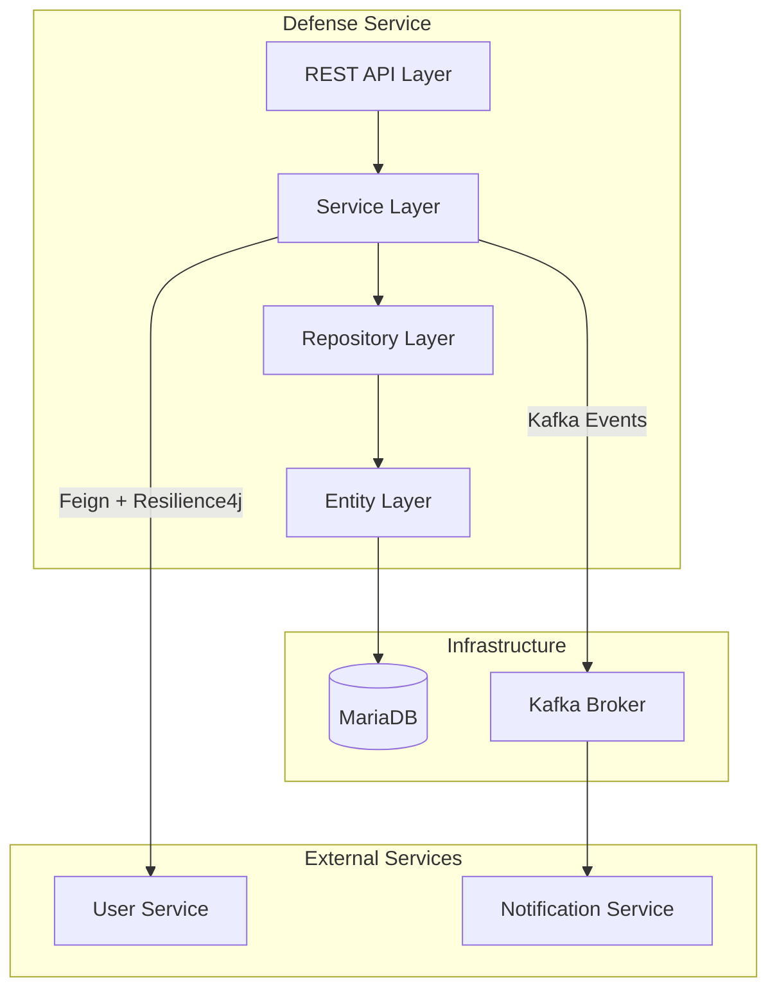

# Design Document: Defense Service Finalization

## Overview

This design document specifies the implementation approach for completing the defense-service microservice. The service currently operates at 75% completion and requires five major enhancements:

1. **Publication Quality Verification System** - Manual validation of Q1/Q2 journal publications by administrators
2. **Complete Authorization Workflow** - End-to-end verification and authorization process for defense requests
3. **Procès-Verbal PDF Generation** - Automated generation of official defense minutes documents
4. **Director Dashboard** - Consolidated view for thesis directors to monitor their doctoral students
5. **Statistics and Reporting** - Comprehensive analytics and PDF report generation for administrators

The design follows Spring Boot microservice patterns with JPA entities, REST controllers, service layer business logic, and integration with existing infrastructure (Kafka for events, Resilience4j for fault tolerance, Feign for inter-service communication).

## Architecture

### System Context



````

### Layered Architecture

The implementation follows a standard Spring Boot layered architecture:

- **Controller Layer**: REST endpoints for HTTP API
- **Service Layer**: Business logic and orchestration
- **Repository Layer**: Data access using Spring Data JPA
- **Entity Layer**: JPA entities mapped to database tables
- **DTO Layer**: Data transfer objects for API requests/responses
- **Mapper Layer**: Entity-DTO conversion using MapStruct or manual mapping

### Integration Points

1. **User Service (Feign Client)**
   - Purpose: Retrieve user details (doctorant, directeur, jury members)
   - Pattern: Synchronous HTTP calls with Resilience4j circuit breaker
   - Fallback: Return minimal user info from cache or default values

2. **Notification Service (Kafka)**
   - Purpose: Publish defense workflow events for notifications
   - Pattern: Asynchronous event publishing
   - Topic: `defense-events`

3. **MariaDB Database**
   - Purpose: Persistent storage for all defense-related entities
   - Schema: Existing tables + new tables for publications and authorizations

## Components and Interfaces

### 1. Publication Management Component

**Purpose**: Manage doctoral publications with quality verification

**New Entity**: `Publication`
```java
@Entity
@Table(name = "publications")
public class Publication {
    @Id
    @GeneratedValue(strategy = GenerationType.IDENTITY)
    private Long id;

    @ManyToOne
    @JoinColumn(name = "prerequisites_id")
    private Prerequisites prerequisites;

    private String titre;
    private String journal;
    private Integer anneePublication;

    @Enumerated(EnumType.STRING)
    private TypePublication type;

    @Enumerated(EnumType.STRING)
    private QuartileJournal quartile;

    private String doi;
    private String url;

    // Validation fields
    private boolean valide;
    private Long validateurId;
    private String commentaireValidation;
    private LocalDateTime dateValidation;
}
````

**New Enums**:

```java
public enum TypePublication {
    JOURNAL_ARTICLE,
    CONFERENCE,
    CHAPITRE_LIVRE,
    BREVET
}

public enum QuartileJournal {
    Q1, Q2, Q3, Q4, NON_CLASSE
}
```

**REST Endpoints**:

- `POST /api/defense-service/publications` - Create publication
- `GET /api/defense-service/publications/prerequisites/{id}` - List publications for prerequisites
- `PUT /api/defense-service/publications/{id}/valider` - Validate publication quality
- `GET /api/defense-service/publications/en-attente-validation` - List pending validations

**Service Methods**:

```java
public interface PublicationService {
    PublicationResponseDTO createPublication(PublicationCreateDTO dto);
    List<PublicationResponseDTO> getPublicationsByPrerequisites(Long prerequisitesId);
    PublicationResponseDTO validatePublication(Long id, ValidationDTO dto);
    List<PublicationResponseDTO> getPendingValidations();
    boolean hasValidQ1Q2Publications(Long prerequisitesId, int minRequired);
}
```

### 2. Authorization Workflow Component

**Purpose**: Verify prerequisites and issue official defense authorization

**New Entity**: `AutorisationSoutenance`

```java
@Entity
@Table(name = "autorisations_soutenance")
public class AutorisationSoutenance {
    @Id
    @GeneratedValue(strategy = GenerationType.IDENTITY)
    private Long id;

    @OneToOne
    @JoinColumn(name = "defense_request_id")
    private DefenseRequest defenseRequest;

    @Enumerated(EnumType.STRING)
    private StatutAutorisation statut;

    private Long administrateurId;
    private LocalDateTime dateAutorisation;

    // Verification results
    private boolean prerequisValides;
    private boolean juryComplet;
    private boolean rapportsFavorables;
    private boolean documentsComplets;

    private String commentaireAdmin;
    private String motifRefus;

    // Scheduling info
    private LocalDateTime dateSoutenance;
    private String lieuSoutenance;
    private String salleSoutenance;
}
```

**New Enum**:

```java
public enum StatutAutorisation {
    EN_ATTENTE,
    AUTORISE,
    REFUSE
}
```

**REST Endpoints**:

- `POST /api/defense-service/autorisation/{defenseRequestId}/verifier` - Verify all prerequisites
- `POST /api/defense-service/autorisation/{defenseRequestId}/autoriser` - Authorize defense
- `POST /api/defense-service/autorisation/{defenseRequestId}/refuser` - Refuse authorization
- `GET /api/defense-service/autorisation/{defenseRequestId}` - Get authorization details

**Service Methods**:

```java
public interface AutorisationService {
    VerificationResultDTO verifierPrerequisAutorisation(Long defenseRequestId);
    AutorisationSoutenanceDTO autoriser(Long defenseRequestId, AutorisationDTO dto);
    AutorisationSoutenanceDTO refuser(Long defenseRequestId, RefusDTO dto);
    AutorisationSoutenanceDTO getAutorisation(Long defenseRequestId);
}
```

**Verification Logic**:

```java
public class VerificationResultDTO {
    private boolean peutAutoriser;
    private Map<String, Boolean> verificationsDetaillees;
    private List<String> blocages;
}

// Verification checks:
// 1. Prerequisites validated (including Q1/Q2 publications)
// 2. Jury complete (president + min rapporteurs + min examiners)
// 3. All rapporteurs submitted favorable reports
// 4. All required documents uploaded
```

### 3. Procès-Verbal Generation Component

**Purpose**: Generate official PDF minutes after defense completion

**Service**: `ProcesVerbalPdfGenerator`

```java
public interface ProcesVerbalPdfGenerator {
    byte[] generateProcesVerbal(Defense defense);
}
```

**PDF Template Structure**:

- Header: Institution logo and title
- Section 1: Doctorant information (name, CIN)
- Section 2: Thesis title
- Section 3: Defense date, time, and location
- Section 4: Jury composition with roles
- Section 5: Defense outcome and mention
- Section 6: Jury recommendations
- Section 7: Signature spaces for all jury members
- Footer: Date and location

**Technology**: iText 7 library for PDF generation

**REST Endpoints**:

- `POST /api/defense-service/defenses/{id}/finaliser` - Finalize defense and generate PV
- `GET /api/defense-service/defenses/{id}/proces-verbal` - Download PV PDF

**Service Methods**:

```java
public interface DefenseService {
    DefenseResponseDTO finalizeDefense(Long id, FinalizationDTO dto);
    byte[] getProcesVerbal(Long id, Long userId);
}
```

### 4. Director Dashboard Component

**Purpose**: Provide consolidated view for thesis directors

**REST Endpoint**:

- `GET /api/defense-service/directeur/{directeurId}/dashboard`

**Response DTO**:

```java
public class DirecteurDashboardDTO {
    private UserDTO directeur;
    private StatistiquesDirecteurDTO statistiques;
    private List<DefenseRequestSummaryDTO> demandesSoutenance;
    private List<DefenseScheduledDTO> soutenancesProgrammees;
    private List<AlerteDTO> alertes;
}

public class StatistiquesDirecteurDTO {
    private int doctorantsActifs;
    private int soutenancesAPlanifier;
    private int rapportsEnAttente;
    private int jurysAProposer;
}
```

**Service Methods**:

```java
public interface DirecteurDashboardService {
    DirecteurDashboardDTO getDashboard(Long directeurId);
}
```

### 5. Statistics and Reporting Component

**Purpose**: Provide analytics and generate PDF reports

**REST Endpoints**:

- `GET /api/defense-service/admin/statistiques` - Get overall statistics
- `GET /api/defense-service/admin/rapports/mensuel?mois=2025-01` - Generate monthly report
- `GET /api/defense-service/admin/rapports/annuel?annee=2025` - Generate annual report

**Response DTO**:

```java
public class StatistiquesDTO {
    private Map<DefenseRequestStatus, Long> demandesParStatut;
    private List<DefenseCountByMonthDTO> soutenancesParMois;
    private Map<Mention, Long> mentionsDistribuees;
    private double tauxReussiteGlobal;
    private double dureeMoyenneSoutenance; // in years
}
```

**Service Methods**:

```java
public interface StatistiquesService {
    StatistiquesDTO getStatistiques();
    byte[] generateMonthlyReport(YearMonth month);
    byte[] generateAnnualReport(int year);
}
```

### 6. Kafka Event Publisher Component

**Purpose**: Publish defense workflow events to Kafka

**Event DTOs**:

```java
public class DefenseEventDTO {
    private String eventType;
    private LocalDateTime timestamp;
    private Map<String, Object> payload;
}
```

**Event Types**:

- `DEMANDE_SOUTENANCE_SOUMISE`
- `JURY_PROPOSE`
- `RAPPORT_SOUMIS`
- `SOUTENANCE_AUTORISEE`
- `SOUTENANCE_REFUSEE`
- `SOUTENANCE_FINALISEE`

**Service Methods**:

```java
public interface DefenseEventPublisher {
    void publishDemandeSubmitted(DefenseRequest request);
    void publishJuryProposed(Jury jury);
    void publishRapportSubmitted(Rapport rapport);
    void publishDefenseAuthorized(AutorisationSoutenance autorisation);
    void publishDefenseRefused(AutorisationSoutenance autorisation);
    void publishDefenseFinalized(Defense defense);
}
```

**Kafka Configuration**:

```java
@Configuration
public class KafkaProducerConfig {
    @Value("${spring.kafka.bootstrap-servers}")
    private String bootstrapServers;

    @Bean
    public ProducerFactory<String, DefenseEventDTO> producerFactory() {
        // Configure JSON serialization
    }

    @Bean
    public KafkaTemplate<String, DefenseEventDTO> kafkaTemplate() {
        return new KafkaTemplate<>(producerFactory());
    }
}
```

## Data Models

### Updated Prerequisites Entity

The existing `Prerequisites` entity needs enhancement to support the publication relationship:

```java
@Entity
@Table(name = "prerequisites")
public class Prerequisites {
    // ... existing fields ...

    @OneToMany(mappedBy = "prerequisites", cascade = CascadeType.ALL)
    private List<Publication> publications = new ArrayList<>();

    // Update validation logic to check Q1/Q2 publications
}
```

### Updated Defense Entity

The existing `Defense` entity already has most required fields. Minor additions:

```java
@Entity
@Table(name = "defenses")
public class Defense {
    // ... existing fields ...

    // procesVerbalUrl already exists
    // mention already exists
    // publicationRecommended already exists
    // juryComments already exists
    // deliberationDate already exists

    // No changes needed - entity is complete
}
```

### Database Schema Changes

**New Table: publications**

```sql
CREATE TABLE publications (
    id BIGINT AUTO_INCREMENT PRIMARY KEY,
    prerequisites_id BIGINT NOT NULL,
    titre VARCHAR(500) NOT NULL,
    journal VARCHAR(255),
    annee_publication INT,
    type VARCHAR(50) NOT NULL,
    quartile VARCHAR(20),
    doi VARCHAR(255),
    url VARCHAR(500),
    valide BOOLEAN DEFAULT FALSE,
    validateur_id BIGINT,
    commentaire_validation TEXT,
    date_validation DATETIME,
    FOREIGN KEY (prerequisites_id) REFERENCES prerequisites(id),
    INDEX idx_prerequisites_id (prerequisites_id),
    INDEX idx_valide (valide)
);
```

**New Table: autorisations_soutenance**

```sql
CREATE TABLE autorisations_soutenance (
    id BIGINT AUTO_INCREMENT PRIMARY KEY,
    defense_request_id BIGINT NOT NULL UNIQUE,
    statut VARCHAR(50) NOT NULL,
    administrateur_id BIGINT,
    date_autorisation DATETIME,
    prerequis_valides BOOLEAN,
    jury_complet BOOLEAN,
    rapports_favorables BOOLEAN,
    documents_complets BOOLEAN,
    commentaire_admin TEXT,
    motif_refus TEXT,
    date_soutenance DATETIME,
    lieu_soutenance VARCHAR(255),
    salle_soutenance VARCHAR(100),
    FOREIGN KEY (defense_request_id) REFERENCES defense_requests(id),
    INDEX idx_defense_request_id (defense_request_id),
    INDEX idx_statut (statut)
);
```

### Configuration Properties

New application.properties entries:

```properties
# Defense Prerequisites Configuration
defense.prerequis.min-publications-q1q2=2
defense.prerequis.min-conferences=2
defense.prerequis.min-heures-formation=200

# Jury Composition Configuration
defense.jury.min-membres=4
defense.jury.min-rapporteurs=2

# PDF Generation Configuration
pdf.pv.template.path=classpath:templates/pv-soutenance.html
pdf.autorisation.template.path=classpath:templates/autorisation-soutenance.html
pdf.logo.path=classpath:static/images/logo-institution.png

# Kafka Configuration
spring.kafka.bootstrap-servers=localhost:9092
spring.kafka.producer.key-serializer=org.apache.kafka.common.serialization.StringSerializer
spring.kafka.producer.value-serializer=org.springframework.kafka.support.serializer.JsonSerializer
defense.kafka.topic=defense-events
```

## Correctness Properties

A property is a characteristic or behavior that should hold true across all valid executions of a system—essentially, a formal statement about what the system should do. Properties serve as the bridge between human-readable specifications and machine-verifiable correctness guarantees.

### Property 1: Publication Persistence Completeness

_For any_ publication creation request with all required fields (title, journal, year, type, quartile, DOI, URL), the stored publication should contain all provided field values unchanged.
**Validates: Requirements 1.1**

### Property 2: Publication Default Validation State

_For any_ newly created publication, the validation status should be false and validator ID, verification date, and validation comments should be null.
**Validates: Requirements 1.2**

### Property 3: Publication Validation Data Completeness

_For any_ publication validation operation with validator ID, quartile, and comments, the stored publication should contain all validation fields (validator ID, verification date, verified quartile, comments) and validation status should be true.
**Validates: Requirements 1.3, 1.8**

### Property 4: Q1/Q2 Publication Counting Accuracy

_For any_ set of publications associated with prerequisites, counting valid Q1/Q2 publications should return only those publications where validation status is true AND quartile is Q1 or Q2.
**Validates: Requirements 1.4**

### Property 5: Pending Validation Query Correctness

_For any_ query for pending validations, the returned publications should be exactly those where validation status is false.
**Validates: Requirements 1.5**

### Property 6: Prerequisites Q1/Q2 Validation Rule

_For any_ prerequisites with associated publications, the prerequisites should be considered valid only if at least the configured minimum number of validated journal articles with Q1 or Q2 quartile exist.
**Validates: Requirements 1.6**

### Property 7: Journal Article Quartile Requirement

_For any_ publication with type JOURNAL_ARTICLE, the quartile field should be non-null and contain a value from {Q1, Q2, Q3, Q4, NON_CLASSE}.
**Validates: Requirements 1.7**

### Property 8: Authorization Verification Completeness

_For any_ defense request, authorization verification should check all four conditions (prerequisites validated, jury complete, reports favorable, documents uploaded) and return detailed results for each check.
**Validates: Requirements 2.1, 2.11**

### Property 9: Jury Completeness Validation

_For any_ jury, it should be considered complete only if it has at least one member with role PRESIDENT, at least the configured minimum rapporteurs with role RAPPORTEUR, and at least one member with role EXAMINATEUR.
**Validates: Requirements 2.2**

### Property 10: Rapporteur Reports Validation

_For any_ defense request with a jury, all rapporteurs in the jury should have submitted reports with favorable recommendations for the reports check to pass.
**Validates: Requirements 2.3**

### Property 11: Authorization State Transitions

_For any_ defense request that is authorized, an AutorisationSoutenance entity with status AUTORISE should be created, the DefenseRequest status should change to AUTHORIZED, and a Defense entity with the provided scheduling information should be created.
**Validates: Requirements 2.4, 2.5, 2.6**

### Property 12: Refusal State Transitions

_For any_ defense request that is refused, an AutorisationSoutenance entity with status REFUSE and the provided refusal reason should be created, and the DefenseRequest status should change to REJECTED.
**Validates: Requirements 2.8, 2.9**

### Property 13: Authorization Audit Trail

_For any_ authorization (approved or refused), the AutorisationSoutenance entity should record the administrator ID and authorization timestamp.
**Validates: Requirements 2.12**

### Property 14: Defense Finalization Data Persistence

_For any_ defense finalization operation with mention, publication recommendation, jury comments, and deliberation date, the Defense entity should store all provided values and status should change to COMPLETED.
**Validates: Requirements 3.1, 3.5**

### Property 15: Procès-Verbal Generation

_For any_ finalized defense, a PDF procès-verbal should be generated containing doctorant information, thesis title, defense date and location, jury composition with roles, mention, and jury recommendations.
**Validates: Requirements 3.2, 3.3**

### Property 16: Procès-Verbal Access Control

_For any_ procès-verbal download request, access should be granted only if the requesting user is a jury member of that defense, the doctorant, the directeur, or an admin.
**Validates: Requirements 3.7**

### Property 17: Procès-Verbal Availability Constraint

_For any_ defense that is not finalized (status != COMPLETED), requesting the procès-verbal should return an error indicating the defense is not yet completed.
**Validates: Requirements 3.8**

### Property 18: Director Dashboard Statistics Accuracy

_For any_ directeur, the dashboard statistics should accurately count active doctorants, defenses to plan, pending reports, and juries to propose based on the current state of all defense requests where the directeur is associated.
**Validates: Requirements 4.1**

### Property 19: Director Dashboard Data Filtering

_For any_ directeur, the dashboard should return only defense requests and scheduled defenses for doctorants supervised by that directeur.
**Validates: Requirements 4.2, 4.3**

### Property 20: Director Dashboard Alert Generation

_For any_ directeur dashboard request, alerts should be generated for all rapporteurs who have not submitted reports within expected timeframes for that directeur's doctorants.
**Validates: Requirements 4.4, 4.6**

### Property 21: Defense Request DTO Completeness

_For any_ defense request returned in a dashboard or list, the DTO should include doctorant name, request status, doctorate start date, duration, and next required action.
**Validates: Requirements 4.5**

### Property 22: Statistics Aggregation Accuracy

_For any_ statistics request, the counts for defense requests by status, defenses by month, and mentions distribution should accurately reflect the current database state.
**Validates: Requirements 5.1, 5.2, 5.3**

### Property 23: Success Rate Calculation

_For any_ statistics request, the success rate should be calculated as (completed defenses / total finalized defenses) \* 100.
**Validates: Requirements 5.4**

### Property 24: Average Duration Calculation

_For any_ statistics request, the average duration should be calculated as the mean time between doctorate start date and defense completion date across all completed defenses.
**Validates: Requirements 5.5**

### Property 25: Defense Workflow Event Publishing

_For any_ defense workflow state change (request submitted, jury proposed, rapport submitted, defense authorized, defense refused, defense finalized), a corresponding event should be published to the "defense-events" Kafka topic with all required payload fields.
**Validates: Requirements 2.7, 2.10, 3.6, 6.1, 6.2, 6.3, 6.7**

### Property 26: Circuit Breaker Activation

_For any_ sequence of User_Service failures exceeding the configured threshold, the circuit breaker should open and subsequent calls should return fallback responses without attempting User_Service calls.
**Validates: Requirements 7.1, 7.4**

### Property 27: Retry Policy Execution

_For any_ transient User_Service failure, the Defense_Service should retry the request according to the configured retry policy before executing fallback logic.
**Validates: Requirements 7.2, 7.3**

### Property 28: Graceful Degradation

_For any_ User_Service failure during defense data enrichment, the defense operation should complete successfully with fallback user information rather than failing.
**Validates: Requirements 7.5**

### Property 29: Configuration-Driven Validation

_For any_ validation of prerequisites or jury composition, the minimum thresholds used should match the values configured in application properties (min-publications-q1q2, min-conferences, min-heures-formation, min-membres, min-rapporteurs).
**Validates: Requirements 8.1, 8.2, 8.3, 8.4, 8.5, 8.6**

## Error Handling

### Validation Errors

**Publication Validation Errors**:

- `PUBLICATION_NOT_FOUND`: Publication ID does not exist
- `PUBLICATION_ALREADY_VALIDATED`: Attempting to validate an already validated publication
- `INVALID_QUARTILE_FOR_TYPE`: Non-journal publications should not have quartiles
- `MISSING_REQUIRED_FIELD`: Required fields (title, type) are missing

**Authorization Errors**:

- `DEFENSE_REQUEST_NOT_FOUND`: Defense request ID does not exist
- `AUTHORIZATION_ALREADY_EXISTS`: Defense request already has an authorization
- `PREREQUISITES_NOT_VALID`: Prerequisites do not meet minimum requirements
- `JURY_NOT_COMPLETE`: Jury does not have required composition
- `REPORTS_NOT_FAVORABLE`: Not all rapporteurs submitted favorable reports
- `DOCUMENTS_INCOMPLETE`: Required documents are not uploaded

**Defense Finalization Errors**:

- `DEFENSE_NOT_FOUND`: Defense ID does not exist
- `DEFENSE_NOT_AUTHORIZED`: Cannot finalize a defense that is not authorized
- `DEFENSE_ALREADY_FINALIZED`: Defense is already completed
- `INVALID_MENTION`: Mention value is not valid

**Access Control Errors**:

- `UNAUTHORIZED_ACCESS`: User does not have permission to access resource
- `PROCES_VERBAL_NOT_AVAILABLE`: Defense is not finalized, PV not available

### Error Response Format

All errors should return a consistent JSON structure:

```json
{
  "timestamp": "2025-01-15T10:30:00",
  "status": 400,
  "error": "Bad Request",
  "message": "Prerequisites do not meet minimum requirements",
  "code": "PREREQUISITES_NOT_VALID",
  "details": {
    "required_q1q2_publications": 2,
    "actual_q1q2_publications": 1
  },
  "path": "/api/defense-service/autorisation/123/autoriser"
}
```

### Exception Handling Strategy

1. **Business Logic Exceptions**: Custom exceptions for domain violations (e.g., `PrerequisitesNotValidException`)
2. **Not Found Exceptions**: `ResourceNotFoundException` for missing entities
3. **Access Denied Exceptions**: `AccessDeniedException` for authorization failures
4. **Validation Exceptions**: `ValidationException` for input validation failures
5. **External Service Exceptions**: Handled by Resilience4j with fallback responses

### Resilience Patterns

**Circuit Breaker Configuration**:

```yaml
resilience4j.circuitbreaker:
  instances:
    userService:
      registerHealthIndicator: true
      slidingWindowSize: 10
      minimumNumberOfCalls: 5
      permittedNumberOfCallsInHalfOpenState: 3
      automaticTransitionFromOpenToHalfOpenEnabled: true
      waitDurationInOpenState: 10s
      failureRateThreshold: 50
      slowCallRateThreshold: 100
      slowCallDurationThreshold: 2s
```

**Retry Configuration**:

```yaml
resilience4j.retry:
  instances:
    userService:
      maxAttempts: 3
      waitDuration: 500ms
      enableExponentialBackoff: true
      exponentialBackoffMultiplier: 2
```

## Testing Strategy

### Unit Testing

Unit tests will verify individual components in isolation using JUnit 5 and Mockito:

**Service Layer Tests**:

- `PublicationServiceTest`: Test publication CRUD operations, validation logic, Q1/Q2 counting
- `AutorisationServiceTest`: Test verification logic, authorization/refusal workflows
- `ProcesVerbalPdfGeneratorTest`: Test PDF generation with mock data
- `DirecteurDashboardServiceTest`: Test dashboard data aggregation and filtering
- `StatistiquesServiceTest`: Test statistics calculations and aggregations
- `DefenseEventPublisherTest`: Test Kafka event publishing with mock KafkaTemplate

**Repository Layer Tests**:

- Use `@DataJpaTest` for repository integration tests
- Test custom query methods for filtering and aggregation
- Verify database constraints and relationships

**Controller Layer Tests**:

- Use `@WebMvcTest` for controller unit tests
- Test request/response mapping and validation
- Verify HTTP status codes and error responses

### Property-Based Testing

Property-based tests will verify universal properties across many generated inputs using JUnit QuickCheck or jqwik:

**Configuration**: Each property test should run minimum 100 iterations

**Test Organization**: Each correctness property from the design document should have a corresponding property-based test

**Property Test Examples**:

```java
@Property
void publicationPersistenceCompleteness(@ForAll Publication publication) {
    // Feature: defense-service-finalization, Property 1
    PublicationResponseDTO saved = publicationService.createPublication(toDTO(publication));
    assertThat(saved.getTitre()).isEqualTo(publication.getTitre());
    assertThat(saved.getJournal()).isEqualTo(publication.getJournal());
    // ... verify all fields
}

@Property
void publicationDefaultValidationState(@ForAll PublicationCreateDTO dto) {
    // Feature: defense-service-finalization, Property 2
    PublicationResponseDTO created = publicationService.createPublication(dto);
    assertThat(created.isValide()).isFalse();
    assertThat(created.getValidateurId()).isNull();
}

@Property
void q1q2PublicationCountingAccuracy(
    @ForAll List<@From("publicationGenerator") Publication> publications) {
    // Feature: defense-service-finalization, Property 4
    long expected = publications.stream()
        .filter(p -> p.isValide())
        .filter(p -> p.getQuartile() == Q1 || p.getQuartile() == Q2)
        .count();
    long actual = publicationService.countValidQ1Q2Publications(prerequisitesId);
    assertThat(actual).isEqualTo(expected);
}
```

**Generators**: Custom generators for domain objects:

- `PublicationGenerator`: Generate publications with various types, quartiles, validation states
- `DefenseRequestGenerator`: Generate defense requests with varying completeness
- `JuryGenerator`: Generate juries with different compositions
- `RapportGenerator`: Generate reports with favorable/unfavorable recommendations

### Integration Testing

Integration tests will verify end-to-end workflows:

**Test Scenarios**:

1. **Complete Defense Workflow**: Submit request → Validate prerequisites → Propose jury → Submit reports → Authorize → Finalize → Generate PV
2. **Authorization Refusal Flow**: Submit request → Verify prerequisites fail → Refuse authorization
3. **Kafka Event Publishing**: Verify events are published to Kafka for each workflow step
4. **Resilience Testing**: Simulate User_Service failures and verify circuit breaker, retry, and fallback behavior

**Test Configuration**:

- Use `@SpringBootTest` for full application context
- Use Testcontainers for MariaDB and Kafka
- Use WireMock for User_Service simulation

### Test Coverage Goals

- **Line Coverage**: Minimum 80%
- **Branch Coverage**: Minimum 75%
- **Service Layer**: Minimum 90% coverage
- **Critical Paths**: 100% coverage for authorization and finalization workflows

### Testing Tools

- **JUnit 5**: Test framework
- **Mockito**: Mocking framework
- **jqwik**: Property-based testing library
- **AssertJ**: Fluent assertions
- **Testcontainers**: Docker containers for integration tests
- **WireMock**: HTTP service mocking
- **Spring Boot Test**: Spring testing support
- **JaCoCo**: Code coverage reporting
