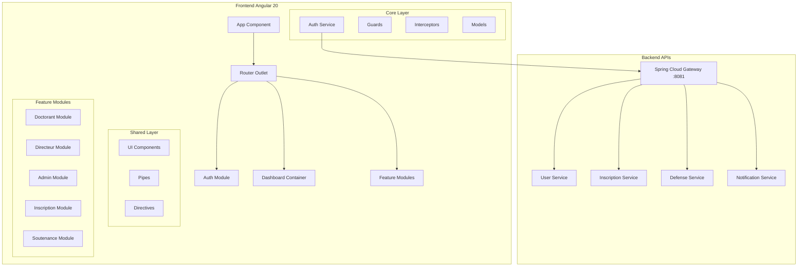

# Design Document - Portail de Suivi du Doctorat Frontend

## Overview

Le Portail de Suivi du Doctorat Frontend est une application Angular 20 qui fournit une interface utilisateur complète pour la gestion du parcours doctoral. L'application utilise une architecture modulaire avec séparation claire des responsabilités et consomme les APIs REST du backend microservices via Spring Cloud Gateway.

### Architecture Existante Analysée

- **Angular Version**: 20.3.0 (dernière version stable)
- **Structure**: Architecture modulaire avec dossiers `core/`, `features/`, `shared/`
- **Authentification**: JWT avec interceptors et guards déjà implémentés
- **Routing**: Routes protégées par rôle avec guards
- **API**: Communication via HttpClient avec interceptors d'erreur

## Architecture

### Architecture Globale



### Structure des Dossiers Cible

```
src/app/
├── core/                          # ✅ Existant - Services globaux
│   ├── guards/                    # ✅ Existant - Protection routes
│   ├── interceptors/              # ✅ Existant - HTTP interceptors
│   ├── models/                    # ✅ Existant - Interfaces TypeScript
│   └── services/                  # ✅ Existant - Services métier
├── shared/                        # ✅ Existant - Composants réutilisables
│   ├── components/                # ✅ Existant - UI components
│   ├── pipes/                     # 🆕 À créer - Pipes personnalisés
│   └── directives/                # 🆕 À créer - Directives personnalisées
├── features/                      # ✅ Existant - Modules fonctionnels
│   ├── auth/                      # ✅ Existant - Authentification
│   ├── dashboard/                 # ✅ Existant - Tableaux de bord
│   ├── inscription/               # 🆕 À créer - Gestion inscriptions
│   ├── soutenance/                # 🆕 À créer - Processus soutenance
│   ├── admin/                     # 🆕 À créer - Administration
│   └── notifications/             # 🆕 À créer - Système notifications
├── assets/                        # ✅ Existant - Ressources statiques
└── environments/                  # ✅ Existant - Configuration
```

## Components and Interfaces

### Core Services Architecture

#### AuthService (Existant - À étendre)
```typescript
interface AuthService {
  // ✅ Méthodes existantes
  login(credentials: LoginRequest): Observable<TokenResponse>
  register(data: RegisterRequest): Observable<any>
  logout(): void
  getCurrentUser(): UserInfo | null
  hasRole(roleName: string): boolean
  
  // 🆕 Méthodes à ajouter
  updateProfile(data: UpdateProfileRequest): Observable<UserResponse>
  changePassword(data: ChangePasswordRequest): Observable<void>
  requestPasswordReset(email: string): Observable<void>
}
```

#### Nouveaux Services à Créer

**InscriptionService**
```typescript
interface InscriptionService {
  // Gestion des campagnes
  getCampagnes(): Observable<Campagne[]>
  getCampagneActive(): Observable<Campagne | null>
  
  // Dossiers d'inscription
  createInscription(data: InscriptionRequest): Observable<InscriptionResponse>
  updateInscription(id: number, data: InscriptionRequest): Observable<InscriptionResponse>
  getMyInscriptions(): Observable<Inscription[]>
  getInscriptionById(id: number): Observable<Inscription>
  
  // Documents
  uploadDocument(file: File, type: DocumentType): Observable<DocumentResponse>
  downloadDocument(documentId: number): Observable<Blob>
  deleteDocument(documentId: number): Observable<void>
}
```

**SoutenanceService**
```typescript
interface SoutenanceService {
  // Demandes de soutenance
  createDemandeSoutenance(data: SoutenanceRequest): Observable<SoutenanceResponse>
  updateDemandeSoutenance(id: number, data: SoutenanceRequest): Observable<SoutenanceResponse>
  getMySoutenances(): Observable<Soutenance[]>
  
  // Prérequis et validation
  checkPrerequis(doctorantId: number): Observable<PrerequisStatus>
  validatePrerequis(soutenanceId: number): Observable<ValidationResponse>
  
  // Jury et planning
  proposeJury(soutenanceId: number, jury: JuryMember[]): Observable<void>
  planifierSoutenance(soutenanceId: number, planning: PlanningData): Observable<void>
}
```

**NotificationService**
```typescript
interface NotificationService {
  // Notifications utilisateur
  getMyNotifications(): Observable<Notification[]>
  markAsRead(notificationId: number): Observable<void>
  markAllAsRead(): Observable<void>
  deleteNotification(notificationId: number): Observable<void>
  
  // Abonnements temps réel (WebSocket)
  subscribeToNotifications(): Observable<Notification>
  unsubscribeFromNotifications(): void
}
```

### Feature Modules Architecture

#### Module Inscription
```typescript
@NgModule({
  declarations: [
    InscriptionFormComponent,
    InscriptionListComponent,
    InscriptionDetailComponent,
    DocumentUploadComponent,
    CampagneInfoComponent
  ],
  imports: [
    CommonModule,
    ReactiveFormsModule,
    SharedModule,
    InscriptionRoutingModule
  ]
})
export class InscriptionModule { }
```

**Routes Inscription**
```typescript
const routes: Routes = [
  {
    path: '',
    component: InscriptionContainerComponent,
    canActivate: [authGuard, roleGuard],
    data: { roles: [RoleName.DOCTORANT] },
    children: [
      { path: '', redirectTo: 'dashboard', pathMatch: 'full' },
      { path: 'dashboard', component: InscriptionDashboardComponent },
      { path: 'nouvelle', component: InscriptionFormComponent },
      { path: 'reinscription', component: ReinscriptionFormComponent },
      { path: ':id', component: InscriptionDetailComponent },
      { path: ':id/edit', component: InscriptionFormComponent }
    ]
  }
];
```

#### Module Soutenance
```typescript
@NgModule({
  declarations: [
    SoutenanceFormComponent,
    SoutenanceListComponent,
    SoutenanceDetailComponent,
    PrerequisCheckComponent,
    JuryProposalComponent,
    PlanningComponent
  ],
  imports: [
    CommonModule,
    ReactiveFormsModule,
    SharedModule,
    SoutenanceRoutingModule
  ]
})
export class SoutenanceModule { }
```

#### Module Admin
```typescript
@NgModule({
  declarations: [
    AdminDashboardComponent,
    CampagneManagementComponent,
    UserManagementComponent,
    DossierValidationComponent,
    StatisticsComponent,
    ParametrageComponent
  ],
  imports: [
    CommonModule,
    ReactiveFormsModule,
    SharedModule,
    AdminRoutingModule
  ]
})
export class AdminModule { }
```

## Data Models

### Modèles Existants (À étendre)
```typescript
// ✅ Existant
interface User {
  id: number;
  FirstName: string;
  LastName: string;
  email: string;
  phoneNumber: string;
  adresse: string;
  ville: string;
  pays: string;
  enabled: boolean;
  roles: Role[];
}

interface Role {
  id: number;
  name: RoleName;
}
```

### Nouveaux Modèles à Créer

**Inscription Models**
```typescript
interface Inscription {
  id: number;
  doctorant: User;
  directeur: User;
  campagne: Campagne;
  sujetThese: string;
  laboratoire: string;
  specialite: string;
  dateInscription: Date;
  statut: InscriptionStatus;
  documents: Document[];
  avisDirecteur?: AvisDirecteur;
  validationAdmin?: ValidationAdmin;
}

interface Campagne {
  id: number;
  nom: string;
  anneeUniversitaire: string;
  dateOuverture: Date;
  dateFermeture: Date;
  active: boolean;
  typeInscription: 'PREMIERE' | 'REINSCRIPTION';
}

enum InscriptionStatus {
  BROUILLON = 'BROUILLON',
  SOUMISE = 'SOUMISE',
  EN_COURS_VALIDATION = 'EN_COURS_VALIDATION',
  VALIDEE = 'VALIDEE',
  REJETEE = 'REJETEE'
}
```

**Soutenance Models**
```typescript
interface Soutenance {
  id: number;
  doctorant: User;
  directeur: User;
  titrethese: string;
  dateSoutenance?: Date;
  lieuSoutenance?: string;
  statut: SoutenanceStatus;
  prerequis: PrerequisStatus;
  jury: JuryMember[];
  documents: Document[];
  rapporteurs: User[];
}

interface PrerequisStatus {
  publicationsValides: boolean;
  heuresFormationValides: boolean;
  dureeDoctoratValide: boolean;
  documentsCompletsValides: boolean;
  prerequisRemplis: boolean;
  details: PrerequisDetail[];
}

interface JuryMember {
  id: number;
  nom: string;
  prenom: string;
  etablissement: string;
  grade: string;
  role: JuryRole;
  externe: boolean;
}

enum SoutenanceStatus {
  BROUILLON = 'BROUILLON',
  SOUMISE = 'SOUMISE',
  EN_COURS_VALIDATION = 'EN_COURS_VALIDATION',
  AUTORISEE = 'AUTORISEE',
  REJETEE = 'REJETEE',
  SOUTENUE = 'SOUTENUE'
}
```

**Document Models**
```typescript
interface Document {
  id: number;
  nom: string;
  type: DocumentType;
  taille: number;
  dateUpload: Date;
  chemin: string;
  obligatoire: boolean;
  valide?: boolean;
}

enum DocumentType {
  // Inscription
  CARTE_IDENTITE = 'CARTE_IDENTITE',
  DIPLOME_MASTER = 'DIPLOME_MASTER',
  RELEVES_NOTES = 'RELEVES_NOTES',
  CV = 'CV',
  LETTRE_MOTIVATION = 'LETTRE_MOTIVATION',
  
  // Soutenance
  MANUSCRIT_THESE = 'MANUSCRIT_THESE',
  RESUME_THESE = 'RESUME_THESE',
  PUBLICATIONS = 'PUBLICATIONS',
  ATTESTATION_FORMATION = 'ATTESTATION_FORMATION',
  AUTORISATION_SOUTENANCE = 'AUTORISATION_SOUTENANCE'
}
```

**Notification Models**
```typescript
interface Notification {
  id: number;
  destinataire: User;
  titre: string;
  message: string;
  type: NotificationType;
  dateCreation: Date;
  dateLecture?: Date;
  lue: boolean;
  actions?: NotificationAction[];
}

enum NotificationType {
  INFO = 'INFO',
  WARNING = 'WARNING',
  SUCCESS = 'SUCCESS',
  ERROR = 'ERROR',
  REMINDER = 'REMINDER'
}

interface NotificationAction {
  label: string;
  route: string;
  icon?: string;
}
```

## Error Handling

### Stratégie de Gestion d'Erreurs

#### HTTP Error Interceptor (Existant - À étendre)
```typescript
@Injectable()
export class ErrorInterceptor implements HttpInterceptor {
  intercept(req: HttpRequest<any>, next: HttpHandler): Observable<HttpEvent<any>> {
    return next.handle(req).pipe(
      catchError((error: HttpErrorResponse) => {
        // ✅ Gestion existante des erreurs 401/403
        if (error.status === 401) {
          this.authService.logout();
          return throwError(() => error);
        }
        
        // 🆕 Gestion étendue des erreurs
        const errorMessage = this.getErrorMessage(error);
        this.notificationService.showError(errorMessage);
        
        return throwError(() => error);
      })
    );
  }
  
  private getErrorMessage(error: HttpErrorResponse): string {
    switch (error.status) {
      case 400: return 'Données invalides. Veuillez vérifier votre saisie.';
      case 404: return 'Ressource non trouvée.';
      case 409: return 'Conflit de données. Cette action ne peut être effectuée.';
      case 422: return 'Données non valides. Veuillez corriger les erreurs.';
      case 500: return 'Erreur serveur. Veuillez réessayer plus tard.';
      default: return error.error?.message || 'Une erreur inattendue s\'est produite.';
    }
  }
}
```

#### Global Error Handler
```typescript
@Injectable()
export class GlobalErrorHandler implements ErrorHandler {
  handleError(error: any): void {
    console.error('Erreur globale:', error);
    
    // Log vers service de monitoring (optionnel)
    if (environment.production) {
      this.logError(error);
    }
    
    // Affichage utilisateur
    this.notificationService.showError(
      'Une erreur inattendue s\'est produite. Veuillez rafraîchir la page.'
    );
  }
}
```

### Validation des Formulaires

#### Validators Personnalisés
```typescript
export class CustomValidators {
  static email(control: AbstractControl): ValidationErrors | null {
    const emailRegex = /^[a-zA-Z0-9._%+-]+@[a-zA-Z0-9.-]+\.[a-zA-Z]{2,}$/;
    return emailRegex.test(control.value) ? null : { email: true };
  }
  
  static phoneNumber(control: AbstractControl): ValidationErrors | null {
    const phoneRegex = /^(\+33|0)[1-9](\d{8})$/;
    return phoneRegex.test(control.value) ? null : { phoneNumber: true };
  }
  
  static fileSize(maxSizeInMB: number) {
    return (control: AbstractControl): ValidationErrors | null => {
      const file = control.value as File;
      if (!file) return null;
      
      const maxSizeInBytes = maxSizeInMB * 1024 * 1024;
      return file.size <= maxSizeInBytes ? null : { fileSize: { maxSize: maxSizeInMB } };
    };
  }
  
  static fileType(allowedTypes: string[]) {
    return (control: AbstractControl): ValidationErrors | null => {
      const file = control.value as File;
      if (!file) return null;
      
      return allowedTypes.includes(file.type) ? null : { fileType: { allowedTypes } };
    };
  }
}
```

## Testing Strategy

### Architecture de Tests

#### Tests Unitaires
- **Services**: Tests des méthodes métier avec mocks des dépendances
- **Components**: Tests des interactions utilisateur et de l'affichage
- **Guards**: Tests des conditions d'accès aux routes
- **Interceptors**: Tests de transformation des requêtes/réponses

#### Tests d'Intégration
- **API Integration**: Tests des appels vers le backend avec HttpClientTestingModule
- **Route Testing**: Tests de navigation et de protection des routes
- **Form Testing**: Tests de validation et soumission des formulaires

#### Tests E2E (Optionnels)
- **User Journeys**: Parcours utilisateur complets par rôle
- **Critical Paths**: Inscription, soutenance, validation administrative

### Configuration de Tests

#### Jest Configuration (Recommandé)
```typescript
// jest.config.js
module.exports = {
  preset: 'jest-preset-angular',
  setupFilesAfterEnv: ['<rootDir>/src/setup-jest.ts'],
  testMatch: ['**/*.spec.ts'],
  collectCoverageFrom: [
    'src/app/**/*.ts',
    '!src/app/**/*.spec.ts',
    '!src/app/**/*.module.ts'
  ],
  coverageThreshold: {
    global: {
      branches: 70,
      functions: 70,
      lines: 70,
      statements: 70
    }
  }
};
```

#### Test Utilities
```typescript
// src/testing/test-utils.ts
export class TestUtils {
  static createMockUser(role: RoleName = RoleName.DOCTORANT): User {
    return {
      id: 1,
      FirstName: 'Test',
      LastName: 'User',
      email: 'test@example.com',
      phoneNumber: '0123456789',
      adresse: 'Test Address',
      ville: 'Test City',
      pays: 'France',
      enabled: true,
      roles: [{ id: 1, name: role }]
    };
  }
  
  static createMockAuthService(): jasmine.SpyObj<AuthService> {
    return jasmine.createSpyObj('AuthService', [
      'login', 'logout', 'getCurrentUser', 'hasRole', 'isAuthenticated'
    ]);
  }
}
```

## UI/UX Design Principles

### Design System

#### Composants UI Réutilisables
```typescript
// shared/components/
├── buttons/
│   ├── primary-button.component.ts
│   ├── secondary-button.component.ts
│   └── icon-button.component.ts
├── forms/
│   ├── form-field.component.ts
│   ├── file-upload.component.ts
│   └── date-picker.component.ts
├── layout/
│   ├── card.component.ts
│   ├── modal.component.ts
│   └── tabs.component.ts
├── feedback/
│   ├── loading-spinner.component.ts
│   ├── progress-bar.component.ts
│   └── alert.component.ts
└── navigation/
    ├── breadcrumb.component.ts
    ├── pagination.component.ts
    └── stepper.component.ts
```

#### Thème et Styles
```scss
// styles/variables.scss
:root {
  // Couleurs principales
  --primary-color: #1976d2;
  --secondary-color: #424242;
  --accent-color: #ff4081;
  
  // États
  --success-color: #4caf50;
  --warning-color: #ff9800;
  --error-color: #f44336;
  --info-color: #2196f3;
  
  // Neutrals
  --background-color: #fafafa;
  --surface-color: #ffffff;
  --text-primary: #212121;
  --text-secondary: #757575;
  
  // Spacing
  --spacing-xs: 4px;
  --spacing-sm: 8px;
  --spacing-md: 16px;
  --spacing-lg: 24px;
  --spacing-xl: 32px;
  
  // Typography
  --font-family: 'Roboto', sans-serif;
  --font-size-sm: 12px;
  --font-size-md: 14px;
  --font-size-lg: 16px;
  --font-size-xl: 18px;
}
```

### Responsive Design
- **Mobile First**: Design adaptatif pour tous les écrans
- **Breakpoints**: 576px (mobile), 768px (tablet), 992px (desktop), 1200px (large)
- **Grid System**: Utilisation de CSS Grid et Flexbox
- **Touch Friendly**: Boutons et zones tactiles adaptées au mobile

### Accessibilité (A11y)
- **ARIA Labels**: Étiquetage approprié des éléments interactifs
- **Keyboard Navigation**: Navigation complète au clavier
- **Color Contrast**: Respect des ratios de contraste WCAG 2.1
- **Screen Readers**: Support des lecteurs d'écran
- **Focus Management**: Gestion appropriée du focus

## Performance Optimization

### Stratégies d'Optimisation

#### Lazy Loading
```typescript
// app.routes.ts
const routes: Routes = [
  {
    path: 'inscription',
    loadChildren: () => import('./features/inscription/inscription.module').then(m => m.InscriptionModule),
    canActivate: [authGuard, roleGuard],
    data: { roles: [RoleName.DOCTORANT] }
  },
  {
    path: 'soutenance',
    loadChildren: () => import('./features/soutenance/soutenance.module').then(m => m.SoutenanceModule),
    canActivate: [authGuard, roleGuard],
    data: { roles: [RoleName.DOCTORANT] }
  },
  {
    path: 'admin',
    loadChildren: () => import('./features/admin/admin.module').then(m => m.AdminModule),
    canActivate: [authGuard, roleGuard],
    data: { roles: [RoleName.ADMIN] }
  }
];
```

#### OnPush Change Detection
```typescript
@Component({
  selector: 'app-inscription-list',
  changeDetection: ChangeDetectionStrategy.OnPush,
  template: `...`
})
export class InscriptionListComponent {
  inscriptions$ = this.inscriptionService.getMyInscriptions();
  
  constructor(
    private inscriptionService: InscriptionService,
    private cdr: ChangeDetectorRef
  ) {}
}
```

#### Caching Strategy
```typescript
@Injectable()
export class CacheService {
  private cache = new Map<string, { data: any; timestamp: number }>();
  private readonly CACHE_DURATION = 5 * 60 * 1000; // 5 minutes
  
  get<T>(key: string): T | null {
    const cached = this.cache.get(key);
    if (!cached) return null;
    
    if (Date.now() - cached.timestamp > this.CACHE_DURATION) {
      this.cache.delete(key);
      return null;
    }
    
    return cached.data;
  }
  
  set<T>(key: string, data: T): void {
    this.cache.set(key, { data, timestamp: Date.now() });
  }
}
```

### Bundle Optimization
- **Tree Shaking**: Élimination du code non utilisé
- **Code Splitting**: Division du code en chunks
- **Preloading**: Préchargement des modules critiques
- **Service Workers**: Mise en cache des ressources statiques

## Security Considerations

### Frontend Security Measures

#### JWT Token Management
```typescript
@Injectable()
export class TokenService {
  private readonly TOKEN_KEY = 'accessToken';
  private readonly REFRESH_TOKEN_KEY = 'refreshToken';
  
  setTokens(accessToken: string, refreshToken: string): void {
    // Stockage sécurisé (httpOnly cookies en production)
    localStorage.setItem(this.TOKEN_KEY, accessToken);
    localStorage.setItem(this.REFRESH_TOKEN_KEY, refreshToken);
  }
  
  getToken(): string | null {
    return localStorage.getItem(this.TOKEN_KEY);
  }
  
  isTokenExpired(token: string): boolean {
    try {
      const payload = JSON.parse(atob(token.split('.')[1]));
      return payload.exp * 1000 < Date.now();
    } catch {
      return true;
    }
  }
  
  clearTokens(): void {
    localStorage.removeItem(this.TOKEN_KEY);
    localStorage.removeItem(this.REFRESH_TOKEN_KEY);
  }
}
```

#### Content Security Policy
```typescript
// Recommandations CSP pour index.html
const cspDirectives = {
  'default-src': "'self'",
  'script-src': "'self' 'unsafe-inline'",
  'style-src': "'self' 'unsafe-inline'",
  'img-src': "'self' data: https:",
  'connect-src': "'self' http://localhost:8081",
  'font-src': "'self'",
  'object-src': "'none'",
  'media-src': "'self'",
  'frame-src': "'none'"
};
```

#### Input Sanitization
```typescript
@Injectable()
export class SanitizationService {
  constructor(private sanitizer: DomSanitizer) {}
  
  sanitizeHtml(html: string): SafeHtml {
    return this.sanitizer.sanitize(SecurityContext.HTML, html) || '';
  }
  
  sanitizeUrl(url: string): SafeUrl {
    return this.sanitizer.sanitize(SecurityContext.URL, url) || '';
  }
  
  escapeHtml(text: string): string {
    const div = document.createElement('div');
    div.textContent = text;
    return div.innerHTML;
  }
}
```

### Route Protection
- **Authentication Guards**: Vérification de l'authentification
- **Role Guards**: Contrôle d'accès basé sur les rôles
- **Feature Guards**: Protection des fonctionnalités selon les permissions
- **Data Guards**: Validation des données avant navigation

## Integration Points

### API Integration Architecture

#### HTTP Client Configuration
```typescript
// core/services/api.service.ts
@Injectable()
export class ApiService {
  private readonly baseUrl = environment.apiUrl;
  
  constructor(private http: HttpClient) {}
  
  // Méthodes génériques
  get<T>(endpoint: string, params?: HttpParams): Observable<T> {
    return this.http.get<T>(`${this.baseUrl}${endpoint}`, { params });
  }
  
  post<T>(endpoint: string, data: any): Observable<T> {
    return this.http.post<T>(`${this.baseUrl}${endpoint}`, data);
  }
  
  put<T>(endpoint: string, data: any): Observable<T> {
    return this.http.put<T>(`${this.baseUrl}${endpoint}`, data);
  }
  
  delete<T>(endpoint: string): Observable<T> {
    return this.http.delete<T>(`${this.baseUrl}${endpoint}`);
  }
  
  // Upload de fichiers
  uploadFile(endpoint: string, file: File, additionalData?: any): Observable<any> {
    const formData = new FormData();
    formData.append('file', file);
    
    if (additionalData) {
      Object.keys(additionalData).forEach(key => {
        formData.append(key, additionalData[key]);
      });
    }
    
    return this.http.post(`${this.baseUrl}${endpoint}`, formData);
  }
}
```

#### WebSocket Integration (Notifications)
```typescript
@Injectable()
export class WebSocketService {
  private socket: WebSocket | null = null;
  private reconnectAttempts = 0;
  private readonly maxReconnectAttempts = 5;
  
  connect(): Observable<any> {
    return new Observable(observer => {
      const token = this.authService.getToken();
      const wsUrl = `${environment.wsUrl}?token=${token}`;
      
      this.socket = new WebSocket(wsUrl);
      
      this.socket.onopen = () => {
        console.log('WebSocket connecté');
        this.reconnectAttempts = 0;
        observer.next({ type: 'connected' });
      };
      
      this.socket.onmessage = (event) => {
        const data = JSON.parse(event.data);
        observer.next(data);
      };
      
      this.socket.onclose = () => {
        console.log('WebSocket fermé');
        this.attemptReconnect(observer);
      };
      
      this.socket.onerror = (error) => {
        console.error('Erreur WebSocket:', error);
        observer.error(error);
      };
    });
  }
  
  private attemptReconnect(observer: any): void {
    if (this.reconnectAttempts < this.maxReconnectAttempts) {
      this.reconnectAttempts++;
      setTimeout(() => this.connect().subscribe(observer), 3000);
    }
  }
}
```

### State Management (Optionnel - NgRx)

Pour les applications complexes avec beaucoup d'état partagé, l'intégration de NgRx pourrait être bénéfique :

```typescript
// store/app.state.ts
export interface AppState {
  auth: AuthState;
  inscriptions: InscriptionState;
  soutenances: SoutenanceState;
  notifications: NotificationState;
}

// store/auth/auth.effects.ts
@Injectable()
export class AuthEffects {
  login$ = createEffect(() =>
    this.actions$.pipe(
      ofType(AuthActions.login),
      switchMap(action =>
        this.authService.login(action.credentials).pipe(
          map(response => AuthActions.loginSuccess({ user: response.user })),
          catchError(error => of(AuthActions.loginFailure({ error })))
        )
      )
    )
  );
}
```

Cette architecture de design fournit une base solide pour le développement du frontend Angular, en s'appuyant sur l'existant et en définissant clairement les extensions nécessaires pour couvrir tous les besoins fonctionnels du Portail de Suivi du Doctorat.