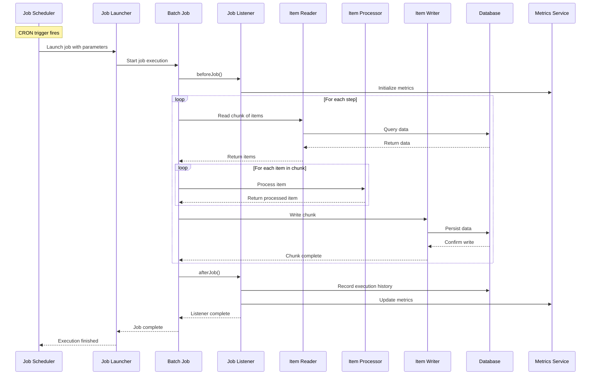
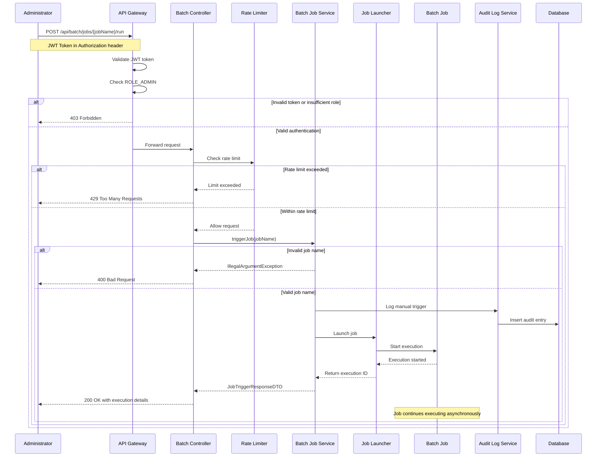
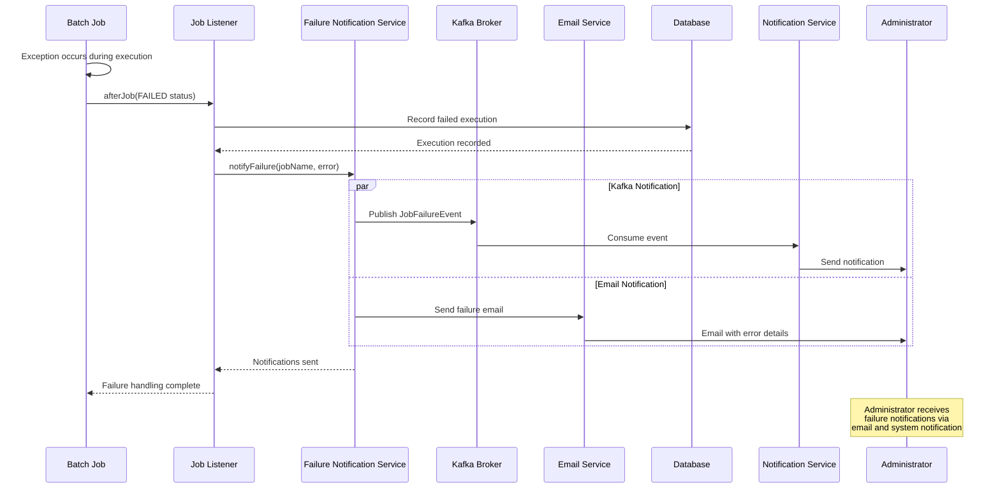
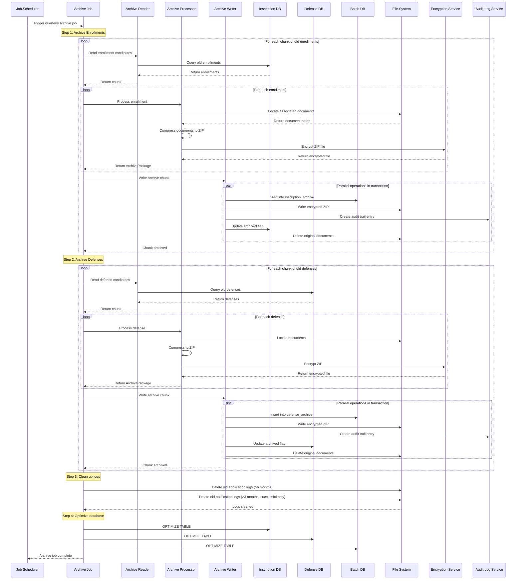
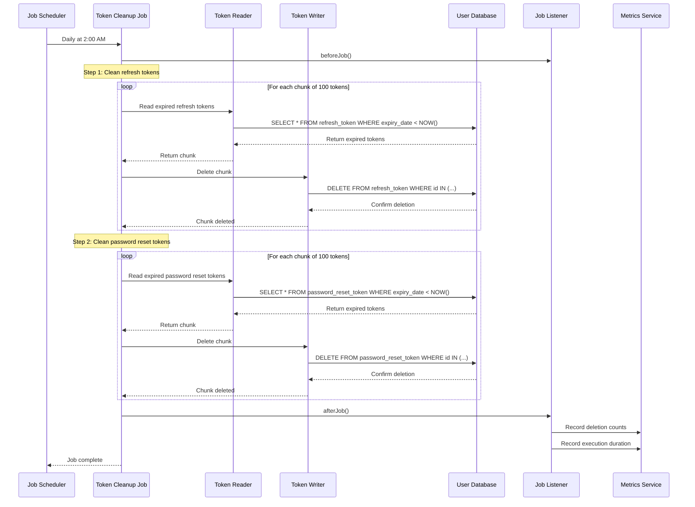
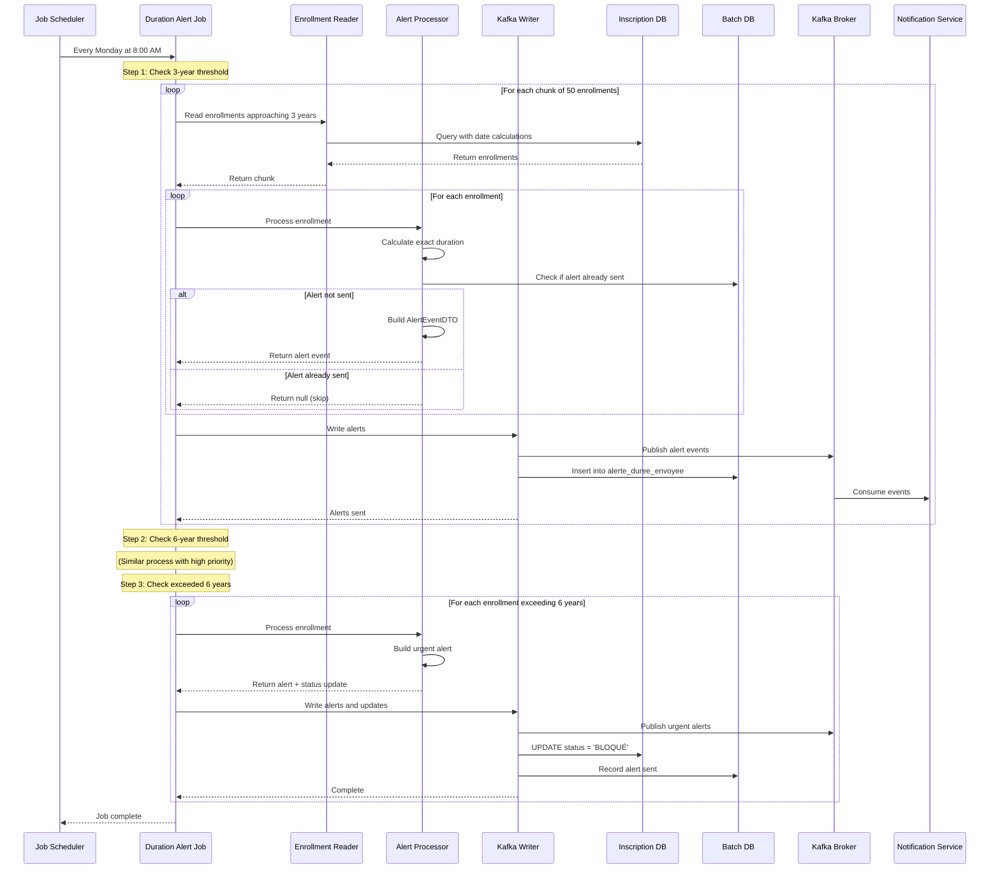
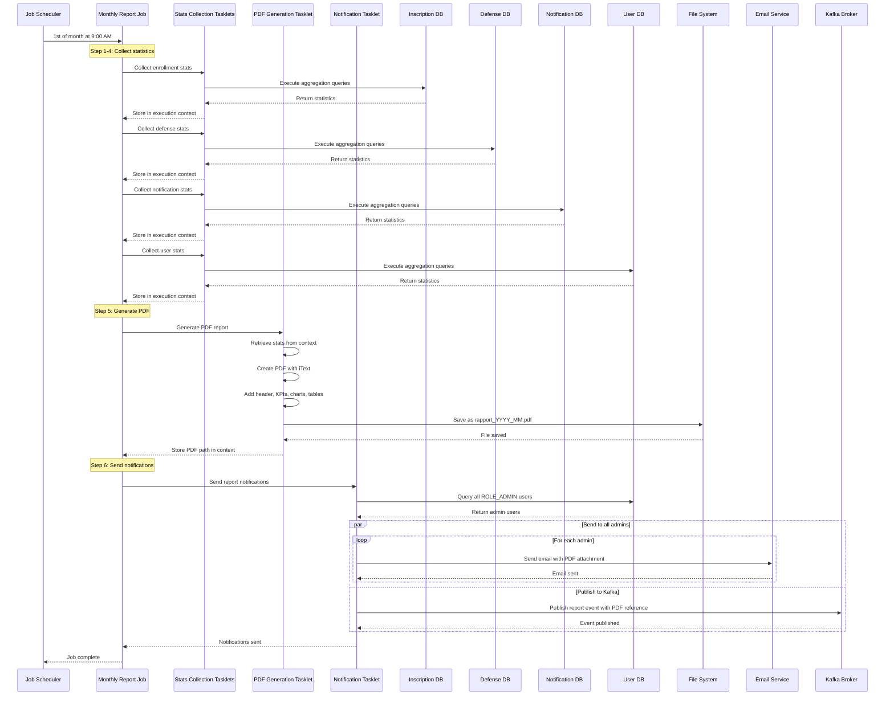
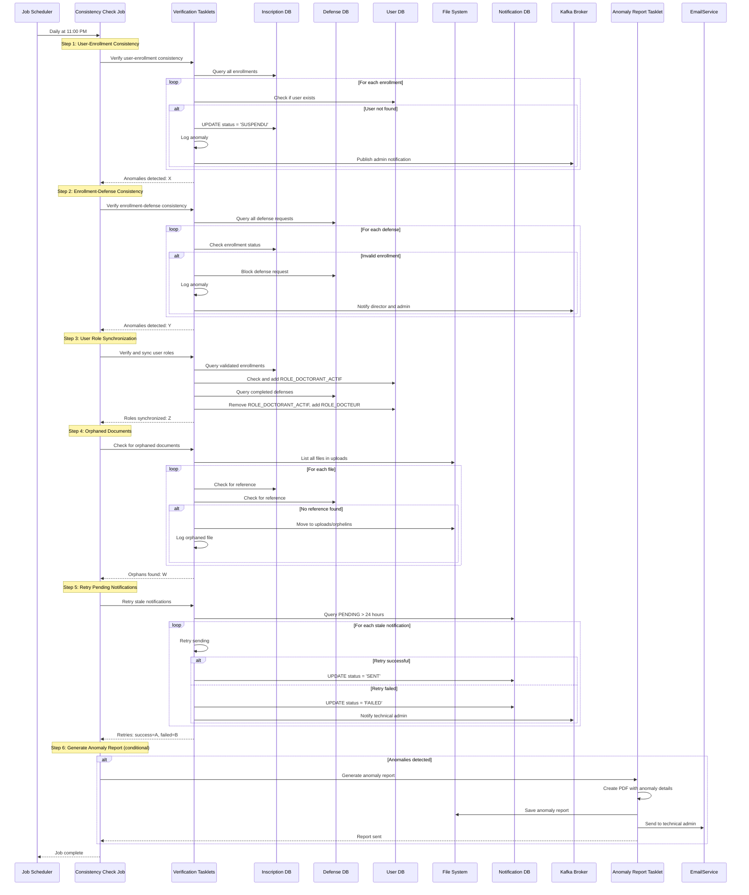

# Batch Service Sequence Diagrams

This document contains sequence diagrams illustrating the key workflows in the batch-service.

## Table of Contents

1. [Job Execution Flow](#1-job-execution-flow)
2. [Manual Job Trigger Flow](#2-manual-job-trigger-flow)
3. [Failure Notification Flow](#3-failure-notification-flow)
4. [Archive Process Flow](#4-archive-process-flow)

---

## 1. Job Execution Flow

This diagram shows the standard execution flow for a scheduled batch job.

---

## 2. Manual Job Trigger Flow

This diagram shows the flow when an administrator manually triggers a job via REST API.

---

## 3. Failure Notification Flow

This diagram shows what happens when a batch job fails.

---

## 4. Archive Process Flow

This diagram shows the complete archive process for old enrollment and defense records.

---

## Additional Diagrams

### Token Cleanup Job Flow

### Duration Alert Job Flow

### Monthly Report Generation Flow

### Data Consistency Check Flow

---

## Diagram Legend

### Participants

- **Scheduler**: Spring @Scheduled annotation triggering jobs via CRON
- **Job Launcher**: Spring Batch JobLauncher for executing jobs
- **Batch Job**: Spring Batch Job with configured steps
- **Item Reader**: Spring Batch ItemReader for reading data
- **Item Processor**: Spring Batch ItemProcessor for transforming data
- **Item Writer**: Spring Batch ItemWriter for writing data
- **Job Listener**: Spring Batch JobExecutionListener for metrics and logging
- **Database**: MariaDB databases (batchdb, userdb, inscriptiondb, defensedb, notificationdb)
- **Kafka Broker**: Apache Kafka for event publishing
- **File System**: Local file system for reports, archives, and uploads
- **Encryption Service**: AES-256 encryption for archive files
- **Audit Log Service**: Service for creating immutable audit trail entries
- **Email Service**: Spring Mail for sending email notifications
- **Notification Service**: External notification microservice consuming Kafka events

### Flow Types

- **Solid arrows (→)**: Synchronous calls
- **Dashed arrows (-->)**: Return values
- **Par blocks**: Parallel execution
- **Alt blocks**: Conditional execution
- **Loop blocks**: Iterative execution
- **Note blocks**: Explanatory comments

---

## Usage

These diagrams can be rendered using any Mermaid-compatible tool:

1. **GitHub/GitLab**: Automatically renders Mermaid diagrams in markdown
2. **Mermaid Live Editor**: https://mermaid.live/
3. **VS Code**: Install Mermaid Preview extension
4. **IntelliJ IDEA**: Built-in Mermaid support in markdown files

---

**Last Updated**: January 2025  
**Version**: 1.0.0
