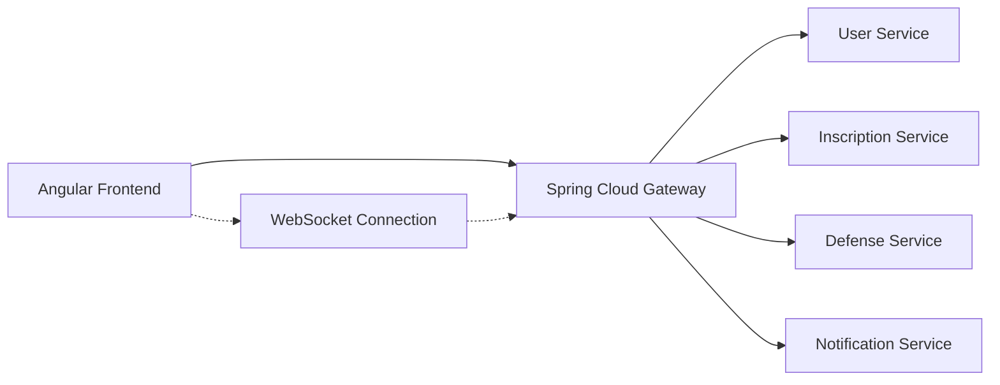
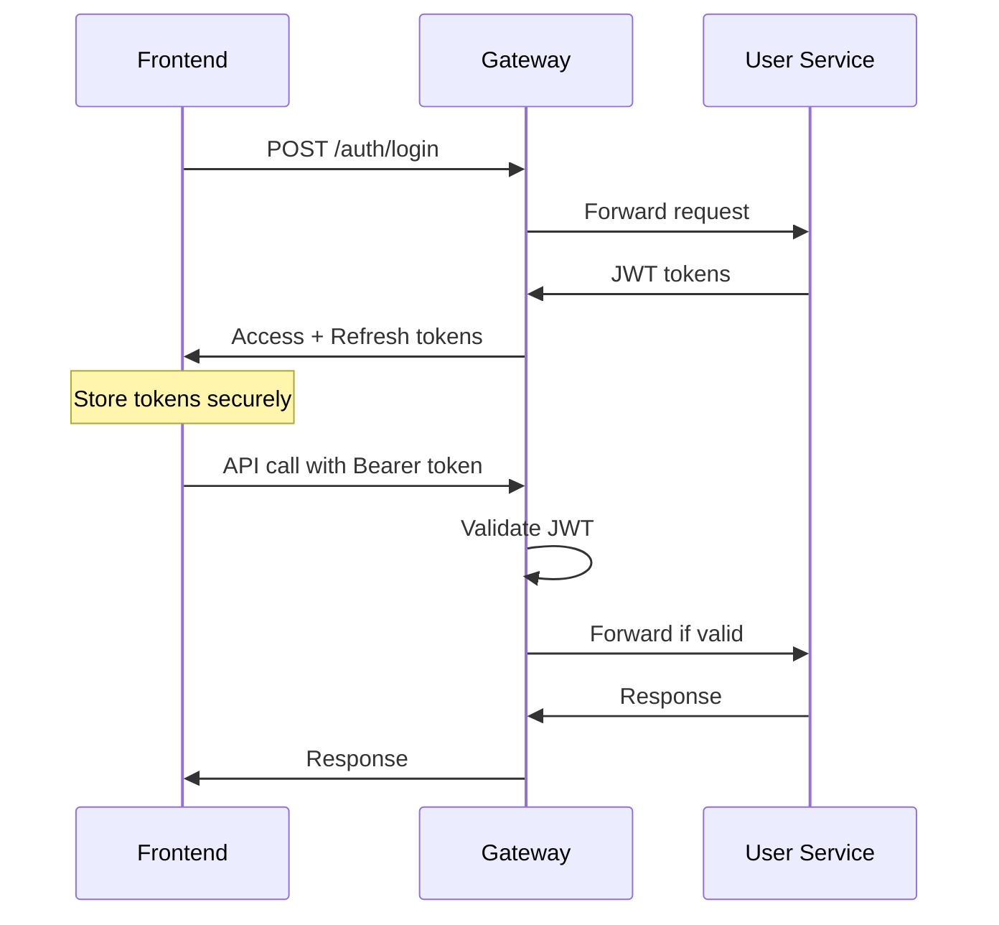

# Documentation d'Intégration API - Portail de Suivi du Doctorat

Cette documentation détaille l'intégration entre le frontend Angular et le backend Spring Boot via les APIs REST et WebSocket.

## 🌐 Vue d'ensemble

### Architecture de communication



### Configuration des endpoints

```typescript
// environment.ts
export const environment = {
  production: false,
  apiUrl: 'http://localhost:8081',        // Spring Cloud Gateway
  wsUrl: 'ws://localhost:8081/ws',        // WebSocket endpoint
  tokenKey: 'accessToken',
  refreshTokenKey: 'refreshToken'
};
```

## 🔐 Authentification

### JWT Token Flow



### Implémentation

#### AuthService

```typescript
@Injectable({
  providedIn: 'root'
})
export class AuthService {
  private readonly API_URL = `${environment.apiUrl}/auth`;
  
  /**
   * Connexion utilisateur
   */
  login(credentials: LoginRequest): Observable<TokenResponse> {
    return this.http.post<TokenResponse>(`${this.API_URL}/login`, credentials)
      .pipe(
        tap(response => {
          this.storeTokens(response.accessToken, response.refreshToken);
          this.loadCurrentUser();
        }),
        catchError(this.handleAuthError)
      );
  }
  
  /**
   * Refresh du token
   */
  refreshToken(): Observable<TokenResponse> {
    const refreshToken = localStorage.getItem(environment.refreshTokenKey);
    if (!refreshToken) {
      return throwError(() => new Error('No refresh token available'));
    }

    return this.http.post<TokenResponse>(`${this.API_URL}/refresh`, { refreshToken })
      .pipe(
        tap(response => {
          this.storeTokens(response.accessToken, response.refreshToken);
        }),
        catchError(error => {
          this.logout();
          return throwError(() => error);
        })
      );
  }
  
  private storeTokens(accessToken: string, refreshToken: string): void {
    localStorage.setItem(environment.tokenKey, accessToken);
    localStorage.setItem(environment.refreshTokenKey, refreshToken);
  }
}
```

#### Auth Interceptor

```typescript
export const authInterceptor: HttpInterceptorFn = (req, next) => {
  const authService = inject(AuthService);
  const token = authService.getToken();
  
  if (token && !authService.isTokenExpired()) {
    const authReq = req.clone({
      setHeaders: {
        Authorization: `Bearer ${token}`
      }
    });
    return next(authReq);
  }
  
  return next(req);
};
```

## 📝 Services d'API

### InscriptionService

#### Endpoints disponibles

| Méthode | Endpoint | Description | Rôle requis |
|---------|----------|-------------|-------------|
| GET | `/inscriptions/me` | Mes inscriptions | DOCTORANT |
| POST | `/inscriptions` | Créer inscription | DOCTORANT |
| POST | `/inscriptions/{id}/soumettre` | Soumettre inscription | DOCTORANT |
| GET | `/inscriptions/directeur/{id}/en-attente` | Inscriptions en attente | DIRECTEUR |
| POST | `/inscriptions/{id}/valider-directeur` | Validation directeur | DIRECTEUR |
| GET | `/inscriptions/admin/en-attente` | Inscriptions admin | ADMIN |
| POST | `/inscriptions/{id}/valider-admin` | Validation admin | ADMIN |

#### Implémentation

```typescript
@Injectable({
  providedIn: 'root'
})
export class InscriptionService {
  private readonly API_URL = `${environment.apiUrl}/inscriptions`;
  
  constructor(
    private http: HttpClient,
    private cacheService: CacheService
  ) {}
  
  /**
   * Récupérer mes inscriptions avec cache
   */
  getMyInscriptions(): Observable<InscriptionResponse[]> {
    const cacheKey = 'my-inscriptions';
    return this.cacheService.cacheObservable(
      cacheKey,
      this.http.get<InscriptionResponse[]>(`${this.API_URL}/me`),
      2 * 60 * 1000 // 2 minutes cache
    );
  }
  
  /**
   * Créer une nouvelle inscription
   */
  createInscription(data: InscriptionRequest): Observable<InscriptionResponse> {
    this.invalidateCache();
    return this.http.post<InscriptionResponse>(this.API_URL, data);
  }
  
  private invalidateCache(): void {
    this.cacheService.remove('my-inscriptions');
    this.cacheService.remove('all-campagnes');
  }
}
```

### SoutenanceService

#### Endpoints disponibles

| Méthode | Endpoint | Description | Rôle requis |
|---------|----------|-------------|-------------|
| GET | `/soutenances/me` | Mes soutenances | DOCTORANT |
| POST | `/soutenances` | Créer demande | DOCTORANT |
| GET | `/soutenances/{id}/prerequis` | Vérifier prérequis | DOCTORANT |
| POST | `/soutenances/{id}/jury` | Proposer jury | DOCTORANT |
| GET | `/soutenances/directeur/en-attente` | Soutenances en attente | DIRECTEUR |
| POST | `/soutenances/{id}/valider` | Valider soutenance | DIRECTEUR |

#### Implémentation

```typescript
@Injectable({
  providedIn: 'root'
})
export class SoutenanceService {
  private readonly API_URL = `${environment.apiUrl}/soutenances`;
  
  /**
   * Vérifier les prérequis de soutenance
   */
  checkPrerequis(doctorantId: number): Observable<PrerequisStatus> {
    return this.http.get<PrerequisStatus>(`${this.API_URL}/prerequis/${doctorantId}`)
      .pipe(
        catchError(error => {
          console.error('Erreur vérification prérequis:', error);
          return throwError(() => error);
        })
      );
  }
  
  /**
   * Créer une demande de soutenance
   */
  createDemandeSoutenance(data: SoutenanceRequest): Observable<SoutenanceResponse> {
    return this.http.post<SoutenanceResponse>(this.API_URL, data)
      .pipe(
        tap(() => {
          // Invalider le cache des soutenances
          this.cacheService.remove('my-soutenances');
        })
      );
  }
}
```

### NotificationService

#### Endpoints disponibles

| Méthode | Endpoint | Description | Rôle requis |
|---------|----------|-------------|-------------|
| GET | `/notifications/me` | Mes notifications | Tous |
| POST | `/notifications/{id}/read` | Marquer comme lu | Tous |
| POST | `/notifications/read-all` | Tout marquer comme lu | Tous |
| DELETE | `/notifications/{id}` | Supprimer notification | Tous |

#### Implémentation avec WebSocket

```typescript
@Injectable({
  providedIn: 'root'
})
export class NotificationService {
  private readonly API_URL = `${environment.apiUrl}/notifications`;
  private notificationsSubject = new BehaviorSubject<Notification[]>([]);
  public notifications$ = this.notificationsSubject.asObservable();
  
  constructor(
    private http: HttpClient,
    private webSocketService: WebSocketService
  ) {
    this.initializeWebSocketConnection();
  }
  
  /**
   * Initialiser la connexion WebSocket pour les notifications temps réel
   */
  private initializeWebSocketConnection(): void {
    this.webSocketService.connect().subscribe({
      next: (message) => {
        if (message.type === 'notification') {
          this.addNotification(message.data);
        }
      },
      error: (error) => {
        console.error('WebSocket error:', error);
      }
    });
  }
  
  /**
   * Récupérer toutes les notifications
   */
  getMyNotifications(): Observable<Notification[]> {
    return this.http.get<Notification[]>(`${this.API_URL}/me`)
      .pipe(
        tap(notifications => {
          this.notificationsSubject.next(notifications);
        })
      );
  }
  
  /**
   * Marquer une notification comme lue
   */
  markAsRead(notificationId: number): Observable<void> {
    return this.http.post<void>(`${this.API_URL}/${notificationId}/read`, {})
      .pipe(
        tap(() => {
          const current = this.notificationsSubject.value;
          const updated = current.map(n => 
            n.id === notificationId ? { ...n, lue: true } : n
          );
          this.notificationsSubject.next(updated);
        })
      );
  }
  
  private addNotification(notification: Notification): void {
    const current = this.notificationsSubject.value;
    this.notificationsSubject.next([notification, ...current]);
  }
}
```

## 🔌 WebSocket Integration

### Configuration WebSocket

```typescript
@Injectable({
  providedIn: 'root'
})
export class WebSocketService {
  private socket: WebSocket | null = null;
  private reconnectAttempts = 0;
  private readonly maxReconnectAttempts = 5;
  private readonly reconnectInterval = 3000;
  
  constructor(private authService: AuthService) {}
  
  connect(): Observable<any> {
    return new Observable(observer => {
      const token = this.authService.getToken();
      if (!token) {
        observer.error('No authentication token available');
        return;
      }
      
      const wsUrl = `${environment.wsUrl}?token=${token}`;
      this.socket = new WebSocket(wsUrl);
      
      this.socket.onopen = () => {
        console.log('✅ WebSocket connected');
        this.reconnectAttempts = 0;
        observer.next({ type: 'connected' });
      };
      
      this.socket.onmessage = (event) => {
        try {
          const data = JSON.parse(event.data);
          observer.next(data);
        } catch (error) {
          console.error('Error parsing WebSocket message:', error);
        }
      };
      
      this.socket.onclose = (event) => {
        console.log('WebSocket closed:', event.code, event.reason);
        if (this.shouldReconnect(event.code)) {
          this.attemptReconnect(observer);
        }
      };
      
      this.socket.onerror = (error) => {
        console.error('WebSocket error:', error);
        observer.error(error);
      };
    });
  }
  
  private shouldReconnect(code: number): boolean {
    // Ne pas reconnecter si c'est une fermeture normale ou une erreur d'auth
    return code !== 1000 && code !== 1001 && code !== 4001;
  }
  
  private attemptReconnect(observer: any): void {
    if (this.reconnectAttempts < this.maxReconnectAttempts) {
      this.reconnectAttempts++;
      console.log(`Attempting to reconnect (${this.reconnectAttempts}/${this.maxReconnectAttempts})`);
      
      setTimeout(() => {
        this.connect().subscribe(observer);
      }, this.reconnectInterval);
    } else {
      observer.error('Max reconnection attempts reached');
    }
  }
  
  disconnect(): void {
    if (this.socket) {
      this.socket.close(1000, 'Client disconnect');
      this.socket = null;
    }
  }
}
```

## 📁 Gestion des Fichiers

### Upload de documents

```typescript
@Injectable({
  providedIn: 'root'
})
export class DocumentService {
  private readonly API_URL = `${environment.apiUrl}/documents`;
  
  /**
   * Upload d'un document avec progress tracking
   */
  uploadDocument(file: File, type: DocumentType): Observable<HttpEvent<DocumentResponse>> {
    const formData = new FormData();
    formData.append('file', file, file.name);
    formData.append('type', type);
    
    return this.http.post<DocumentResponse>(`${this.API_URL}/upload`, formData, {
      reportProgress: true,
      observe: 'events'
    }).pipe(
      catchError(error => {
        console.error('Upload error:', error);
        return throwError(() => error);
      })
    );
  }
  
  /**
   * Téléchargement d'un document
   */
  downloadDocument(documentId: number): Observable<Blob> {
    return this.http.get(`${this.API_URL}/${documentId}/download`, {
      responseType: 'blob'
    }).pipe(
      catchError(error => {
        console.error('Download error:', error);
        return throwError(() => error);
      })
    );
  }
  
  /**
   * Validation d'un fichier avant upload
   */
  validateFile(file: File): { valid: boolean; errors: string[] } {
    const errors: string[] = [];
    const maxSize = 10 * 1024 * 1024; // 10MB
    const allowedTypes = ['application/pdf', 'image/jpeg', 'image/png'];
    
    if (file.size > maxSize) {
      errors.push('Le fichier ne peut pas dépasser 10MB');
    }
    
    if (!allowedTypes.includes(file.type)) {
      errors.push('Type de fichier non autorisé. Utilisez PDF, JPEG ou PNG');
    }
    
    return {
      valid: errors.length === 0,
      errors
    };
  }
}
```

## 🛡️ Gestion des Erreurs

### Error Interceptor

```typescript
export const errorInterceptor: HttpInterceptorFn = (req, next) => {
  return next(req).pipe(
    catchError((error: HttpErrorResponse) => {
      let errorMessage = 'Une erreur inattendue s\'est produite';
      
      switch (error.status) {
        case 400:
          errorMessage = error.error?.message || 'Données invalides';
          break;
        case 401:
          errorMessage = 'Session expirée. Veuillez vous reconnecter';
          // Rediriger vers login
          inject(Router).navigate(['/login']);
          break;
        case 403:
          errorMessage = 'Accès non autorisé';
          break;
        case 404:
          errorMessage = 'Ressource non trouvée';
          break;
        case 409:
          errorMessage = error.error?.message || 'Conflit de données';
          break;
        case 422:
          errorMessage = error.error?.message || 'Données non valides';
          break;
        case 500:
          errorMessage = 'Erreur serveur. Veuillez réessayer plus tard';
          break;
        case 503:
          errorMessage = 'Service temporairement indisponible';
          break;
      }
      
      // Afficher notification d'erreur
      const notificationService = inject(NotificationService);
      notificationService.showError(errorMessage);
      
      return throwError(() => ({ ...error, userMessage: errorMessage }));
    })
  );
};
```

### Retry Logic

```typescript
@Injectable()
export class ApiService {
  private readonly maxRetries = 3;
  private readonly retryDelay = 1000;
  
  get<T>(endpoint: string): Observable<T> {
    return this.http.get<T>(`${environment.apiUrl}${endpoint}`).pipe(
      retry({
        count: this.maxRetries,
        delay: (error, retryCount) => {
          // Ne pas retry sur les erreurs client (4xx)
          if (error.status >= 400 && error.status < 500) {
            return throwError(() => error);
          }
          
          // Délai exponentiel
          return timer(this.retryDelay * Math.pow(2, retryCount - 1));
        }
      }),
      catchError(error => {
        console.error(`API call failed after ${this.maxRetries} retries:`, error);
        return throwError(() => error);
      })
    );
  }
}
```

## 🧪 Tests d'Intégration API

### Service de test backend

```typescript
@Injectable({
  providedIn: 'root'
})
export class BackendTestService {
  constructor(
    private apiService: ApiIntegrationService,
    private authService: AuthService
  ) {}
  
  /**
   * Tester tous les endpoints critiques
   */
  testAllEndpoints(): Observable<BackendTestResults> {
    const tests: Observable<EndpointTest>[] = [
      this.testEndpoint('Health Check', '/health', 'GET', () => 
        this.apiService.get('/health')
      ),
      this.testEndpoint('Authentication', '/auth/me', 'GET', () => 
        this.authService.getCurrentUser()
      ),
      this.testEndpoint('My Inscriptions', '/inscriptions/me', 'GET', () => 
        this.apiService.get('/inscriptions/me')
      ),
      // ... autres tests
    ];
    
    return forkJoin(tests).pipe(
      map(results => this.compileResults(results))
    );
  }
  
  private testEndpoint(
    name: string,
    endpoint: string,
    method: string,
    testFn: () => Observable<any>
  ): Observable<EndpointTest> {
    const startTime = performance.now();
    
    return testFn().pipe(
      map(() => ({
        name,
        endpoint,
        method,
        success: true,
        responseTime: performance.now() - startTime
      })),
      catchError(error => of({
        name,
        endpoint,
        method,
        success: false,
        responseTime: performance.now() - startTime,
        error: error.userMessage || error.message,
        statusCode: error.status
      }))
    );
  }
}
```

### Tests unitaires avec HttpClientTestingModule

```typescript
describe('InscriptionService', () => {
  let service: InscriptionService;
  let httpMock: HttpTestingController;
  
  beforeEach(() => {
    TestBed.configureTestingModule({
      imports: [HttpClientTestingModule],
      providers: [InscriptionService, CacheService]
    });
    
    service = TestBed.inject(InscriptionService);
    httpMock = TestBed.inject(HttpTestingController);
  });
  
  afterEach(() => {
    httpMock.verify();
  });
  
  describe('getMyInscriptions', () => {
    it('should return cached data on second call', () => {
      const mockInscriptions: InscriptionResponse[] = [
        { id: 1, doctorant: { id: 1, name: 'John' }, statut: 'SOUMISE' }
      ];
      
      // Premier appel
      service.getMyInscriptions().subscribe(inscriptions => {
        expect(inscriptions).toEqual(mockInscriptions);
      });
      
      let req = httpMock.expectOne('/api/inscriptions/me');
      req.flush(mockInscriptions);
      
      // Deuxième appel (doit utiliser le cache)
      service.getMyInscriptions().subscribe(inscriptions => {
        expect(inscriptions).toEqual(mockInscriptions);
      });
      
      // Aucune nouvelle requête HTTP ne doit être faite
      httpMock.expectNone('/api/inscriptions/me');
    });
  });
});
```

## 📊 Monitoring et Logging

### Logging des appels API

```typescript
export const loggingInterceptor: HttpInterceptorFn = (req, next) => {
  const startTime = performance.now();
  
  console.log(`🚀 API Call: ${req.method} ${req.url}`);
  
  return next(req).pipe(
    tap({
      next: (event) => {
        if (event.type === HttpEventType.Response) {
          const duration = performance.now() - startTime;
          console.log(`✅ API Success: ${req.method} ${req.url} (${duration.toFixed(2)}ms)`);
        }
      },
      error: (error: HttpErrorResponse) => {
        const duration = performance.now() - startTime;
        console.error(`❌ API Error: ${req.method} ${req.url} (${duration.toFixed(2)}ms)`, error);
      }
    })
  );
};
```

### Métriques de performance

```typescript
@Injectable()
export class ApiMetricsService {
  private metrics = new Map<string, number[]>();
  
  recordApiCall(endpoint: string, duration: number): void {
    if (!this.metrics.has(endpoint)) {
      this.metrics.set(endpoint, []);
    }
    
    const durations = this.metrics.get(endpoint)!;
    durations.push(duration);
    
    // Garder seulement les 100 derniers appels
    if (durations.length > 100) {
      durations.shift();
    }
  }
  
  getAverageResponseTime(endpoint: string): number {
    const durations = this.metrics.get(endpoint);
    if (!durations || durations.length === 0) {
      return 0;
    }
    
    return durations.reduce((sum, duration) => sum + duration, 0) / durations.length;
  }
  
  getAllMetrics(): { endpoint: string; avgTime: number; callCount: number }[] {
    return Array.from(this.metrics.entries()).map(([endpoint, durations]) => ({
      endpoint,
      avgTime: this.getAverageResponseTime(endpoint),
      callCount: durations.length
    }));
  }
}
```

## 🔧 Configuration et Déploiement

### Variables d'environnement

```typescript
// environment.prod.ts
export const environment = {
  production: true,
  apiUrl: 'https://api.portail-doctorat.fr',
  wsUrl: 'wss://api.portail-doctorat.fr/ws',
  tokenKey: 'accessToken',
  refreshTokenKey: 'refreshToken',
  cacheTimeout: 5 * 60 * 1000, // 5 minutes
  retryAttempts: 3,
  retryDelay: 1000
};
```

### Proxy de développement

```json
// proxy.conf.json
{
  "/api/*": {
    "target": "http://localhost:8081",
    "secure": true,
    "changeOrigin": true,
    "logLevel": "debug",
    "headers": {
      "Access-Control-Allow-Origin": "*"
    }
  },
  "/ws": {
    "target": "ws://localhost:8081",
    "ws": true,
    "changeOrigin": true
  }
}
```

### CORS Configuration (Backend)

```java
// Configuration CORS côté Spring Boot
@Configuration
@EnableWebSecurity
public class CorsConfig {
    
    @Bean
    public CorsConfigurationSource corsConfigurationSource() {
        CorsConfiguration configuration = new CorsConfiguration();
        configuration.setAllowedOriginPatterns(Arrays.asList("http://localhost:4200"));
        configuration.setAllowedMethods(Arrays.asList("GET", "POST", "PUT", "DELETE", "OPTIONS"));
        configuration.setAllowedHeaders(Arrays.asList("*"));
        configuration.setAllowCredentials(true);
        
        UrlBasedCorsConfigurationSource source = new UrlBasedCorsConfigurationSource();
        source.registerCorsConfiguration("/**", configuration);
        return source;
    }
}
```

Cette documentation couvre tous les aspects de l'intégration API entre le frontend Angular et le backend Spring Boot, incluant l'authentification, la gestion des erreurs, les WebSockets, et les bonnes pratiques de développement.