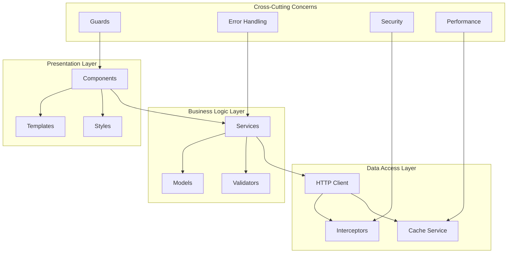
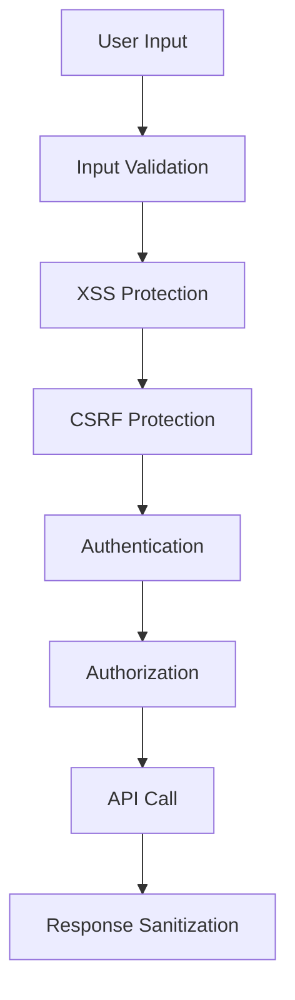
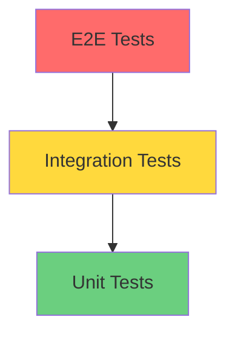
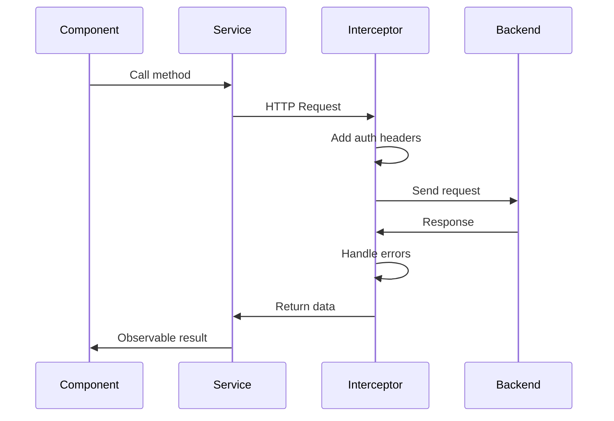

# Architecture Frontend - Portail de Suivi du Doctorat

## Vue d'ensemble

Le frontend du Portail de Suivi du Doctorat est construit avec Angular 20 en utilisant une architecture modulaire, scalable et maintenable. Cette documentation détaille les choix architecturaux, les patterns utilisés et les bonnes pratiques implémentées.

## 🏗️ Architecture Globale

### Diagramme d'architecture



## 📁 Structure des Dossiers

### Organisation modulaire

```
src/app/
├── core/                          # Module principal (singleton)
│   ├── guards/                    # Protection des routes
│   │   ├── auth.guard.ts
│   │   └── role.guard.ts
│   ├── interceptors/              # Intercepteurs HTTP
│   │   ├── auth.interceptor.ts
│   │   ├── error.interceptor.ts
│   │   └── security.interceptor.ts
│   ├── models/                    # Interfaces et types
│   │   ├── user.model.ts
│   │   ├── inscription.model.ts
│   │   └── api.model.ts
│   ├── services/                  # Services métier
│   │   ├── auth.service.ts
│   │   ├── cache.service.ts
│   │   └── security.service.ts
│   ├── config/                    # Configuration
│   │   └── csp.config.ts
│   └── handlers/                  # Gestionnaires globaux
│       └── global-error.handler.ts
├── shared/                        # Composants réutilisables
│   ├── components/                # Composants UI
│   │   ├── navbar/
│   │   ├── sidebar/
│   │   └── loading-spinner/
│   ├── pipes/                     # Pipes personnalisés
│   └── directives/                # Directives personnalisées
├── features/                      # Modules fonctionnels
│   ├── auth/                      # Authentification
│   ├── dashboard/                 # Tableaux de bord
│   ├── inscription/               # Gestion inscriptions
│   ├── soutenance/                # Processus soutenance
│   ├── admin/                     # Administration
│   └── notifications/             # Notifications
└── assets/                        # Ressources statiques
```

### Principe de séparation

#### Core Module
- **Responsabilité** : Services globaux, configuration, sécurité
- **Instanciation** : Singleton (une seule instance)
- **Utilisation** : Importé uniquement dans AppModule

#### Shared Module
- **Responsabilité** : Composants, pipes, directives réutilisables
- **Instanciation** : Multiple (importé dans plusieurs modules)
- **Utilisation** : Importé dans les feature modules

#### Feature Modules
- **Responsabilité** : Fonctionnalités métier spécifiques
- **Instanciation** : Lazy loading (chargement à la demande)
- **Utilisation** : Routes avec loadChildren

## 🔄 Patterns Architecturaux

### 1. Dependency Injection

Angular utilise un système d'injection de dépendances hiérarchique :

```typescript
// Service avec providedIn: 'root' (singleton)
@Injectable({
  providedIn: 'root'
})
export class AuthService { }

// Service avec provider local
@Component({
  providers: [LocalService]
})
export class MyComponent { }
```

### 2. Observable Pattern (RxJS)

Utilisation intensive des Observables pour la programmation réactive :

```typescript
// Service avec Observable
@Injectable()
export class DataService {
  private dataSubject = new BehaviorSubject<Data[]>([]);
  public data$ = this.dataSubject.asObservable();
  
  updateData(newData: Data[]): void {
    this.dataSubject.next(newData);
  }
}

// Composant avec souscription
@Component({})
export class MyComponent implements OnInit, OnDestroy {
  private destroy$ = new Subject<void>();
  
  ngOnInit(): void {
    this.dataService.data$
      .pipe(takeUntil(this.destroy$))
      .subscribe(data => this.handleData(data));
  }
  
  ngOnDestroy(): void {
    this.destroy$.next();
    this.destroy$.complete();
  }
}
```

### 3. Facade Pattern

Services qui encapsulent la complexité métier :

```typescript
@Injectable()
export class InscriptionFacade {
  constructor(
    private inscriptionService: InscriptionService,
    private documentService: DocumentService,
    private notificationService: NotificationService
  ) {}
  
  async submitInscription(data: InscriptionData): Promise<void> {
    // Orchestration de plusieurs services
    const inscription = await this.inscriptionService.create(data);
    await this.documentService.uploadDocuments(inscription.id, data.documents);
    this.notificationService.showSuccess('Inscription soumise avec succès');
  }
}
```

### 4. Strategy Pattern

Différentes stratégies selon le contexte :

```typescript
// Interface commune
interface ValidationStrategy {
  validate(data: any): ValidationResult;
}

// Implémentations spécifiques
@Injectable()
export class InscriptionValidationStrategy implements ValidationStrategy {
  validate(data: InscriptionData): ValidationResult {
    // Logique de validation spécifique aux inscriptions
  }
}

@Injectable()
export class SoutenanceValidationStrategy implements ValidationStrategy {
  validate(data: SoutenanceData): ValidationResult {
    // Logique de validation spécifique aux soutenances
  }
}
```

## 🔐 Architecture de Sécurité

### Couches de sécurité



### Implémentation

#### 1. Guards (Protection des routes)

```typescript
@Injectable()
export class AuthGuard implements CanActivate {
  canActivate(): boolean {
    return this.authService.isAuthenticated();
  }
}

@Injectable()
export class RoleGuard implements CanActivate {
  canActivate(route: ActivatedRouteSnapshot): boolean {
    const requiredRole = route.data['role'];
    return this.authService.hasRole(requiredRole);
  }
}
```

#### 2. Interceptors (Middleware HTTP)

```typescript
@Injectable()
export class AuthInterceptor implements HttpInterceptor {
  intercept(req: HttpRequest<any>, next: HttpHandler): Observable<HttpEvent<any>> {
    const token = this.authService.getToken();
    if (token) {
      req = req.clone({
        setHeaders: { Authorization: `Bearer ${token}` }
      });
    }
    return next.handle(req);
  }
}
```

#### 3. Content Security Policy

```typescript
export const CSP_CONFIG = {
  'default-src': ["'self'"],
  'script-src': ["'self'", "'unsafe-inline'"],
  'style-src': ["'self'", "'unsafe-inline'"],
  'connect-src': ["'self'", "http://localhost:8081"]
};
```

## ⚡ Architecture de Performance

### Stratégies d'optimisation

#### 1. Lazy Loading

```typescript
// Routes avec chargement différé
const routes: Routes = [
  {
    path: 'inscription',
    loadChildren: () => import('./features/inscription/inscription.module')
      .then(m => m.InscriptionModule)
  }
];
```

#### 2. OnPush Change Detection

```typescript
@Component({
  changeDetection: ChangeDetectionStrategy.OnPush
})
export class OptimizedComponent {
  constructor(private cdr: ChangeDetectorRef) {}
  
  updateData(newData: any): void {
    this.data = newData;
    this.cdr.markForCheck(); // Déclencher la détection manuelle
  }
}
```

#### 3. Cache Service

```typescript
@Injectable()
export class CacheService {
  private cache = new Map<string, CacheEntry>();
  
  cacheObservable<T>(key: string, source: Observable<T>): Observable<T> {
    const cached = this.cache.get(key);
    if (cached && !this.isExpired(cached)) {
      return of(cached.data);
    }
    
    return source.pipe(
      tap(data => this.cache.set(key, { data, timestamp: Date.now() }))
    );
  }
}
```

#### 4. Bundle Optimization

```typescript
// Préchargement stratégique
@NgModule({
  imports: [
    RouterModule.forRoot(routes, {
      preloadingStrategy: PreloadAllModules
    })
  ]
})
export class AppRoutingModule { }
```

## 🔄 Gestion d'État

### Architecture sans state management complexe

Pour ce projet, nous utilisons une approche simplifiée avec des services et RxJS :

```typescript
// Service d'état simple
@Injectable()
export class AppStateService {
  private userSubject = new BehaviorSubject<User | null>(null);
  private notificationsSubject = new BehaviorSubject<Notification[]>([]);
  
  // Observables publics
  user$ = this.userSubject.asObservable();
  notifications$ = this.notificationsSubject.asObservable();
  
  // Actions
  setUser(user: User): void {
    this.userSubject.next(user);
  }
  
  addNotification(notification: Notification): void {
    const current = this.notificationsSubject.value;
    this.notificationsSubject.next([...current, notification]);
  }
}
```

### Quand utiliser NgRx

NgRx serait recommandé si :
- L'application devient plus complexe (>50 composants)
- Beaucoup d'état partagé entre composants
- Besoin de time-travel debugging
- Équipe importante nécessitant des patterns stricts

## 🧪 Architecture de Tests

### Pyramide de tests



### Structure des tests

#### 1. Tests unitaires (Base de la pyramide)

```typescript
describe('AuthService', () => {
  let service: AuthService;
  let httpMock: HttpTestingController;
  
  beforeEach(() => {
    TestBed.configureTestingModule({
      imports: [HttpClientTestingModule],
      providers: [AuthService]
    });
    service = TestBed.inject(AuthService);
    httpMock = TestBed.inject(HttpTestingController);
  });
  
  it('should login successfully', () => {
    const mockResponse = { token: 'fake-token' };
    
    service.login({ email: 'test@test.com', password: 'password' })
      .subscribe(response => {
        expect(response.token).toBe('fake-token');
      });
    
    const req = httpMock.expectOne('/api/auth/login');
    expect(req.request.method).toBe('POST');
    req.flush(mockResponse);
  });
});
```

#### 2. Tests d'intégration

```typescript
describe('InscriptionComponent Integration', () => {
  let component: InscriptionComponent;
  let fixture: ComponentFixture<InscriptionComponent>;
  let inscriptionService: jasmine.SpyObj<InscriptionService>;
  
  beforeEach(() => {
    const spy = jasmine.createSpyObj('InscriptionService', ['create']);
    
    TestBed.configureTestingModule({
      declarations: [InscriptionComponent],
      providers: [{ provide: InscriptionService, useValue: spy }]
    });
    
    fixture = TestBed.createComponent(InscriptionComponent);
    component = fixture.componentInstance;
    inscriptionService = TestBed.inject(InscriptionService) as jasmine.SpyObj<InscriptionService>;
  });
  
  it('should create inscription when form is valid', () => {
    // Test d'intégration composant + service
  });
});
```

## 🔌 Intégration Backend

### Architecture de communication



### Gestion des erreurs

```typescript
@Injectable()
export class ErrorInterceptor implements HttpInterceptor {
  intercept(req: HttpRequest<any>, next: HttpHandler): Observable<HttpEvent<any>> {
    return next.handle(req).pipe(
      catchError((error: HttpErrorResponse) => {
        switch (error.status) {
          case 401:
            this.authService.logout();
            break;
          case 403:
            this.router.navigate(['/unauthorized']);
            break;
          case 500:
            this.notificationService.showError('Erreur serveur');
            break;
        }
        return throwError(() => error);
      })
    );
  }
}
```

## 📱 Responsive Design

### Architecture mobile-first

```scss
// Breakpoints
$breakpoints: (
  mobile: 576px,
  tablet: 768px,
  desktop: 992px,
  large: 1200px
);

// Mixins
@mixin mobile-up {
  @media (min-width: map-get($breakpoints, mobile)) {
    @content;
  }
}

@mixin tablet-up {
  @media (min-width: map-get($breakpoints, tablet)) {
    @content;
  }
}
```

### Composants adaptatifs

```typescript
@Component({
  template: `
    <div class="responsive-container">
      <div class="mobile-view" *ngIf="isMobile">
        <!-- Vue mobile -->
      </div>
      <div class="desktop-view" *ngIf="!isMobile">
        <!-- Vue desktop -->
      </div>
    </div>
  `
})
export class ResponsiveComponent {
  isMobile = this.breakpointObserver.isMatched('(max-width: 768px)');
}
```

## 🌐 Internationalisation (i18n)

### Architecture i18n (préparation future)

```typescript
// Structure pour l'i18n
interface TranslationKeys {
  common: {
    save: string;
    cancel: string;
    delete: string;
  };
  inscription: {
    title: string;
    form: {
      firstName: string;
      lastName: string;
    };
  };
}

// Service de traduction
@Injectable()
export class TranslationService {
  private translations: TranslationKeys;
  
  translate(key: string): string {
    return this.getNestedProperty(this.translations, key);
  }
}
```

## 🔄 Cycle de Vie des Composants

### Hooks utilisés

```typescript
@Component({})
export class LifecycleComponent implements OnInit, OnDestroy, AfterViewInit {
  private destroy$ = new Subject<void>();
  
  ngOnInit(): void {
    // Initialisation des données
    this.loadData();
  }
  
  ngAfterViewInit(): void {
    // Initialisation après rendu de la vue
    this.initializeThirdPartyLibs();
  }
  
  ngOnDestroy(): void {
    // Nettoyage des souscriptions
    this.destroy$.next();
    this.destroy$.complete();
  }
  
  private loadData(): void {
    this.dataService.getData()
      .pipe(takeUntil(this.destroy$))
      .subscribe(data => this.handleData(data));
  }
}
```

## 📊 Monitoring et Observabilité

### Métriques collectées

1. **Performance**
   - Temps de chargement des composants
   - Temps de réponse des API
   - Core Web Vitals

2. **Erreurs**
   - Erreurs JavaScript
   - Erreurs HTTP
   - Violations CSP

3. **Utilisation**
   - Pages visitées
   - Actions utilisateur
   - Temps de session

### Implémentation

```typescript
@Injectable()
export class MonitoringService {
  trackPageView(page: string): void {
    // Envoyer vers service d'analytics
  }
  
  trackError(error: Error): void {
    // Envoyer vers service de monitoring d'erreurs
  }
  
  trackPerformance(metric: string, value: number): void {
    // Envoyer vers service de monitoring de performance
  }
}
```

## 🚀 Évolutivité

### Préparation pour la croissance

1. **Modularité** : Architecture modulaire permettant l'ajout facile de nouvelles fonctionnalités
2. **Lazy Loading** : Chargement à la demande pour maintenir les performances
3. **Cache** : Système de cache extensible
4. **Tests** : Couverture de tests pour faciliter les refactorings
5. **Documentation** : Documentation complète pour faciliter la maintenance

### Patterns pour l'extension

```typescript
// Plugin pattern pour l'extensibilité
interface FeaturePlugin {
  name: string;
  initialize(): void;
  destroy(): void;
}

@Injectable()
export class PluginManager {
  private plugins: FeaturePlugin[] = [];
  
  registerPlugin(plugin: FeaturePlugin): void {
    this.plugins.push(plugin);
    plugin.initialize();
  }
}
```

Cette architecture garantit une application maintenable, performante et sécurisée, prête pour les évolutions futures.